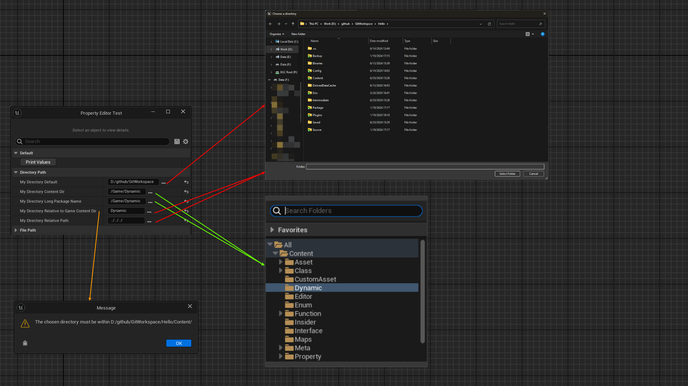

# ContentDir

- **Function description:** Use the UE style to select Content and its subdirectories.
- **Use location:** UPROPERTY
- **Engine module:** Path Property
- **Metadata type:** bool
- **Restriction type:** FDirectoryPath
- **Associated items:** [RelativePath](../RelativePath.md), [RelativeToGameContentDir](../RelativeToGameContentDir.md)
- **Commonly used:** ★★★

Use the UE style to select Content and its subdirectories.

By default, selecting a directory will prompt the Windows default directory selection dialog, as FDirectoryPath can indeed be used to select any directory within the Windows system (which may be what your project requires). However, if you specifically want to select a directory under UE Content, specifying ContentDir will allow UE to pop up a dedicated UE directory selection dialog, which is more convenient and reduces errors.

When using FDirectoryPath, ContentDir and LongPackageName are equivalent.

## Test Code:

```cpp
UCLASS(BlueprintType)
class INSIDER_API UMyProperty_Path :public UObject
{
	GENERATED_BODY()
public:
	UPROPERTY(EditAnywhere, BlueprintReadWrite, Category = DirectoryPath)
	FDirectoryPath MyDirectory_Default;

	UPROPERTY(EditAnywhere, BlueprintReadWrite, Category = DirectoryPath, meta = (ContentDir))
	FDirectoryPath MyDirectory_ContentDir;
	UPROPERTY(EditAnywhere, BlueprintReadWrite, Category = DirectoryPath, meta = (LongPackageName))
	FDirectoryPath MyDirectory_LongPackageName;

	UPROPERTY(EditAnywhere, BlueprintReadWrite, Category = DirectoryPath, meta = (RelativeToGameContentDir))
	FDirectoryPath MyDirectory_RelativeToGameContentDir;

	UPROPERTY(EditAnywhere, BlueprintReadWrite, Category = DirectoryPath, meta = (RelativePath))
	FDirectoryPath MyDirectory_RelativePath;
};

```

## Test Results:

- By default, MyDirectory_Default will open the system dialog, allowing any directory to be selected.
- MyDirectory_ContentDir and MyDirectory_LongPackageName will, as shown in the figure, pop up a UE-style dialog to select the directory.
- MyDirectory_RelativeToGameContentDir and MyDirectory_RelativePath will both pop up the system dialog. The difference is that the final directory for MyDirectory_RelativeToGameContentDir will be restricted to the Content directory (if another directory is selected, an error warning will appear), resulting in a relative path. MyDirectory_RelativePath also results in a relative path but allows any directory to be selected.



## Principle:

The editing of FDirectoryPath is customized with FDirectoryPathStructCustomization. As the code shows, if there is a ContentDir or LongPackageName, OnPickContent is used to select the directory. Internally, ContentBrowserModule.Get().CreatePathPicker(PathPickerConfig) is used to create a specialized directory selection menu.

Otherwise, the OnPickDirectory branch is taken, and DesktopPlatform->OpenDirectoryDialog is used to open the system dialog.

This can also be observed in the source code:

bRelativeToGameContentDir causes Directory.RightChopInline(AbsoluteGameContentDir.Len(), EAllowShrinking::No); to cut off the left part of the Content path.

bUseRelativePath triggers Directory = IFileManager::Get().ConvertToRelativePath(*Directory); to convert the path to a relative path.

```cpp
/** Structure for directory paths that are displayed in the editor with a picker UI. */
USTRUCT(BlueprintType)
struct FDirectoryPath
{
	GENERATED_BODY()

	/**
	* The path to the directory.
	*/
	UPROPERTY(EditAnywhere, BlueprintReadWrite, Category = Path)
	FString Path;
};

RegisterCustomPropertyTypeLayout("DirectoryPath", FOnGetPropertyTypeCustomizationInstance::CreateStatic(&FDirectoryPathStructCustomization::MakeInstance));
RegisterCustomPropertyTypeLayout("FilePath", FOnGetPropertyTypeCustomizationInstance::CreateStatic(&FFilePathStructCustomization::MakeInstance));

void FDirectoryPathStructCustomization::CustomizeHeader( TSharedRef<IPropertyHandle> StructPropertyHandle, class FDetailWidgetRow& HeaderRow, IPropertyTypeCustomizationUtils& StructCustomizationUtils )
{
	TSharedPtr<IPropertyHandle> PathProperty = StructPropertyHandle->GetChildHandle("Path");

	const bool bRelativeToGameContentDir = StructPropertyHandle->HasMetaData( TEXT("RelativeToGameContentDir") );
	const bool bUseRelativePath = StructPropertyHandle->HasMetaData( TEXT("RelativePath") );
	const bool bContentDir = StructPropertyHandle->HasMetaData( TEXT("ContentDir") ) || StructPropertyHandle->HasMetaData(TEXT("LongPackageName"));

	AbsoluteGameContentDir = FPaths::ConvertRelativePathToFull(FPaths::ProjectContentDir());

	if(bContentDir)
	{
		PickerWidget = SAssignNew(PickerButton, SButton)
		.ButtonStyle( FAppStyle::Get(), "HoverHintOnly" )
		.ToolTipText( LOCTEXT( "FolderComboToolTipText", "Choose a content directory") )
		.OnClicked( this, &FDirectoryPathStructCustomization::OnPickContent, PathProperty.ToSharedRef() )
		.ContentPadding(2.0f)
		.ForegroundColor( FSlateColor::UseForeground() )
		.IsFocusable(false)
		.IsEnabled(this, &FDirectoryPathStructCustomization::IsBrowseEnabled, StructPropertyHandle)
		[
			SNew(SImage)
			.Image(FAppStyle::GetBrush("PropertyWindow.Button_Ellipsis"))
			.ColorAndOpacity(FSlateColor::UseForeground())
		];

	}
	else
	{
		PickerWidget = SAssignNew(BrowseButton, SButton)
		.ButtonStyle( FAppStyle::Get(), "HoverHintOnly" )
		.ToolTipText( LOCTEXT( "FolderButtonToolTipText", "Choose a directory from this computer") )
		.OnClicked( this, &FDirectoryPathStructCustomization::OnPickDirectory, PathProperty.ToSharedRef(), bRelativeToGameContentDir, bUseRelativePath )
		.ContentPadding( 2.0f )
		.ForegroundColor( FSlateColor::UseForeground() )
		.IsFocusable( false )
		.IsEnabled( this, &FDirectoryPathStructCustomization::IsBrowseEnabled, StructPropertyHandle )
		[
			SNew( SImage )
			.Image( FAppStyle::GetBrush("PropertyWindow.Button_Ellipsis") )
			.ColorAndOpacity( FSlateColor::UseForeground() )
		];
	}
}

FReply FDirectoryPathStructCustomization::OnPickContent(TSharedRef<IPropertyHandle> PropertyHandle)
{
	FContentBrowserModule& ContentBrowserModule = FModuleManager::LoadModuleChecked<FContentBrowserModule>("ContentBrowser");
	FPathPickerConfig PathPickerConfig;
	PropertyHandle->GetValue(PathPickerConfig.DefaultPath);
	PathPickerConfig.bAllowContextMenu = false;
	PathPickerConfig.OnPathSelected = FOnPathSelected::CreateSP(this, &FDirectoryPathStructCustomization::OnPathPicked, PropertyHandle);

	FMenuBuilder MenuBuilder(true, NULL);
	MenuBuilder.AddWidget(SNew(SBox)
		.WidthOverride(300.0f)
		.HeightOverride(300.0f)
		[
			ContentBrowserModule.Get().CreatePathPicker(PathPickerConfig)
		], FText());

	PickerMenu = FSlateApplication::Get().PushMenu(PickerButton.ToSharedRef(),
		FWidgetPath(),
		MenuBuilder.MakeWidget(),
		FSlateApplication::Get().GetCursorPos(),
		FPopupTransitionEffect(FPopupTransitionEffect::ContextMenu)
		);

	return FReply::Handled();
}

FReply FDirectoryPathStructCustomization::OnPickDirectory(TSharedRef<IPropertyHandle> PropertyHandle, const bool bRelativeToGameContentDir, const bool bUseRelativePath) const
{
	FString Directory;
	IDesktopPlatform* DesktopPlatform = FDesktopPlatformModule::Get();
	if (DesktopPlatform)
	{

		TSharedPtr<SWindow> ParentWindow = FSlateApplication::Get().FindWidgetWindow(BrowseButton.ToSharedRef());
		void* ParentWindowHandle = (ParentWindow.IsValid() && ParentWindow->GetNativeWindow().IsValid()) ? ParentWindow->GetNativeWindow()->GetOSWindowHandle() : nullptr;

		FString StartDirectory = FEditorDirectories::Get().GetLastDirectory(ELastDirectory::GENERIC_IMPORT);
		if (bRelativeToGameContentDir && !IsValidPath(StartDirectory, bRelativeToGameContentDir))
		{
			StartDirectory = AbsoluteGameContentDir;
		}

		// Loop until; a) the user cancels (OpenDirectoryDialog returns false), or, b) the chosen path is valid (IsValidPath returns true)
		for (;;)
		{
			if (DesktopPlatform->OpenDirectoryDialog(ParentWindowHandle, LOCTEXT("FolderDialogTitle", "Choose a directory").ToString(), StartDirectory, Directory))
			{
				FText FailureReason;
				if (IsValidPath(Directory, bRelativeToGameContentDir, &FailureReason))
				{
					FEditorDirectories::Get().SetLastDirectory(ELastDirectory::GENERIC_IMPORT, Directory);

					if (bRelativeToGameContentDir)
					{
						Directory.RightChopInline(AbsoluteGameContentDir.Len(), EAllowShrinking::No);
					}
					else if (bUseRelativePath)
					{
						Directory = IFileManager::Get().ConvertToRelativePath(*Directory);
					}

					PropertyHandle->SetValue(Directory);
				}
				else
				{
					StartDirectory = Directory;
					FMessageDialog::Open(EAppMsgType::Ok, FailureReason);
					continue;
				}
			}
			break;
		}
	}

	return FReply::Handled();
}

```