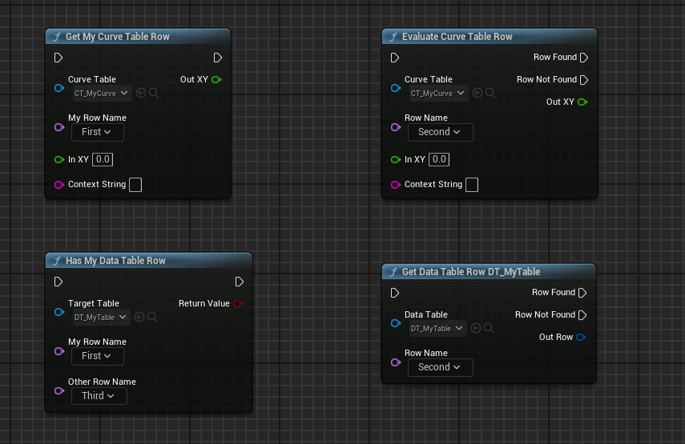

#DataTablePin

- **Function Description:** Specifies a function parameter as DataTable or CurveTable type to allow selection of RowNameList for other parameters of FName.
- **Usage Location:** UFUNCTION
- **Engine Module:** Pin
- **Metadata Type:** string="abc"
- **Restricted Types:** DataTable, CurveTable
- **Commonliness:** ★★

Designates a function parameter as UDataTable type, enabling the loading of data from the DataTable to provide a List for RowName selection, instead of manual input. Supported types include DataTable and CurveTable

For DataTablePin, UK2Node_CallDataTableFunction is used to generate a blueprint node, which triggers the refresh of RowNameList when the DataTable Pin connection parameters change.

UK2Node_GetDataTableRow is also a standalone blueprint node.

However, RowName is not specified with meta? There is a function parameter type check; if it is FName, it is treated as RowName. (This simple and rough check is due to the intention not to provide this Meta for user use.) Therefore, there can actually be multiple FName parameters in the function, all of which are automatically assigned to RowNameList

The only place this is used in the source code is UDataTableFunctionLibrary

```cpp
UFUNCTION(BlueprintCallable, Category = "DataTable", meta = (ExpandEnumAsExecs="OutResult", DataTablePin="CurveTable"))
static ENGINE_API void EvaluateCurveTableRow(UCurveTable* CurveTable, FName RowName, float InXY, TEnumAsByte<EEvaluateCurveTableResult::Type>& OutResult, float& OutXY,const FString& ContextString);
```

## Test Code:

```cpp
	UFUNCTION(BlueprintCallable, meta = (DataTablePin="CurveTable"))
	static void GetMyCurveTableRow(UCurveTable* CurveTable, FName MyRowName, float InXY, float& OutXY,const FString& ContextString){}

	UFUNCTION(BlueprintCallable, meta = (DataTablePin="TargetTable"))
	static bool HasMyDataTableRow(UDataTable* TargetTable, FName MyRowName,FName OtherRowName){return false;}
```

## Blueprint Effect:

The function node on the left is user-defined. You can see that the names on the blueprint nodes on the left have changed to the RowNameList from CurveTable and DataTable, even though these FName parameters have no special designations. The blueprint system automatically recognizes the FName type and changes the actual Pin Widget.



## Principle:

If an FName node is detected, it attempts to find the DataTablePin and then adjusts the Pin type of the FName according to the type of the DataTablePin.

```cpp
TSharedPtr<class SGraphPin> FBlueprintGraphPanelPinFactory::CreatePin(class UEdGraphPin* InPin) const
{
	if (InPin->PinType.PinCategory == UEdGraphSchema_K2::PC_Name)
	{
		UObject* Outer = InPin->GetOuter();

		// Create drop down combo boxes for DataTable and CurveTable RowName pins
		const UEdGraphPin* DataTablePin = nullptr;
		if (Outer->IsA(UK2Node_CallFunction::StaticClass()))
		{
			const UK2Node_CallFunction* CallFunctionNode = CastChecked<UK2Node_CallFunction>(Outer);
			if (CallFunctionNode)
			{
				const UFunction* FunctionToCall = CallFunctionNode->GetTargetFunction();
				if (FunctionToCall)
				{
					const FString& DataTablePinName = FunctionToCall->GetMetaData(FBlueprintMetadata::MD_DataTablePin);
					DataTablePin = CallFunctionNode->FindPin(DataTablePinName);
				}
			}
		}
		else if (Outer->IsA(UK2Node_GetDataTableRow::StaticClass()))
		{
			const UK2Node_GetDataTableRow* GetDataTableRowNode = CastChecked<UK2Node_GetDataTableRow>(Outer);
			DataTablePin = GetDataTableRowNode->GetDataTablePin();
		}

		if (DataTablePin)
		{
			if (DataTablePin->DefaultObject != nullptr && DataTablePin->LinkedTo.Num() == 0)
			{
				if (auto DataTable = Cast<UDataTable>(DataTablePin->DefaultObject))
				{
					return SNew(SGraphPinDataTableRowName, InPin, DataTable);
				}
				if (DataTablePin->DefaultObject->IsA(UCurveTable::StaticClass()))
				{
					UCurveTable* CurveTable = (UCurveTable*)DataTablePin->DefaultObject;
					if (CurveTable)
					{
						TArray<TSharedPtr<FName>> RowNames;
						/** Extract all the row names from the RowMap */
						for (TMap<FName, FRealCurve*>::TConstIterator Iterator(CurveTable->GetRowMap()); Iterator; ++Iterator)
						{
							/** Create a simple array of the row names */
							TSharedPtr<FName> RowNameItem = MakeShareable(new FName(Iterator.Key()));
							RowNames.Add(RowNameItem);
						}
						return SNew(SGraphPinNameList, InPin, RowNames);
					}
				}
			}
		}
	}

	return nullptr;
}

```