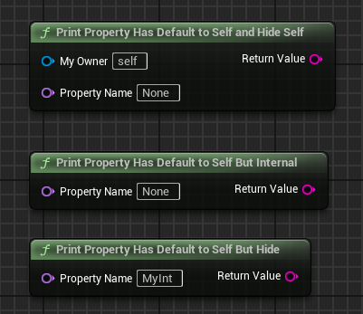

# HideSelfPin

- **Function Description:** Used in function calls to conceal the default SelfPin, which is the Target, thereby restricting the function to being called only within the OwnerClass.
- **Usage Location:** UFUNCTION
- **Engine Module:** Pin
- **Metadata Type:** bool
- **Commonality:** ★★

Used in function calls to hide the default SelfPin, which is the Target, resulting in the function being callable only within the OwnerClass.

Comments indicate it is typically used in conjunction with the DefaultToSelf specifier, but no examples were found in the source code.

Similar to HidePin and InternalUseParam, but while the latter can hide other parameters, HideSelfPin can only hide the SelfPin

## Logic Code:

It can be observed that the visibility of SelfPin's bHidden is influenced by certain conditions:

1. If the function is Static (either a function in the blueprint function library or a static function in C++), SelfPin is hidden by default since no Target is required for invocation.
2. If the function is marked with HideSelfPin, it is also hidden by default and cannot be connected externally, limiting the function to being called only within the class.
3. If the function is a BlueprintPure function and is being called within the OwnerClass, there is no need to display the SelfPin.
4. Only this particular instance of judgment and application is found in the source code. Therefore, it can be inferred that HideSelfPin only conceals the Self, meaning it only hides the This pointer (which is the Self, or Target) when a class member function is called, but does not hide the parameters when a Static function is called, even if those parameters are marked with DefaultToSelf. Being marked with DefaultToSelf indicates that the parameter's default value is the Self value of the external calling environment, not the SelfPin on this function node. The SelfPin of a static function is always hidden. The parameter marked with DefaultToSelf may have a value equal to Self, but it is not the SelfPin.

```cpp
bool UK2Node_CallFunction::CreatePinsForFunctionCall(const UFunction* Function)
{
//...
		if (bIsStaticFunc)
		{
			// For static methods, wire up the self to the CDO of the class if it's not us
			if (!bIsFunctionCompatibleWithSelf)
			{
				UClass* AuthoritativeClass = FunctionOwnerClass->GetAuthoritativeClass();
				SelfPin->DefaultObject = AuthoritativeClass->GetDefaultObject();
			}

			// Purity doesn't matter with a static function, we can always hide the self pin since we know how to call the method
			SelfPin->bHidden = true;
		}
		else
		{
			if (Function->GetBoolMetaData(FBlueprintMetadata::MD_HideSelfPin))
			{
				SelfPin->bHidden = true;
				SelfPin->bNotConnectable = true;
			}
			else
			{
				// Hide the self pin if the function is compatible with the blueprint class and pure (the !bIsConstFunc portion should be going away soon too hopefully)
				SelfPin->bHidden = (bIsFunctionCompatibleWithSelf && bIsPureFunc && !bIsConstFunc);
			}
		}
}
```

## C++ Test Code:

```cpp
UCLASS()
class INSIDER_API UMyFunctionLibrary_SelfPinTest :public UBlueprintFunctionLibrary
{
	GENERATED_BODY()

	UFUNCTION(BlueprintPure,meta=(DefaultToSelf="myOwner",hidePin="myOwner"))
	static FString PrintProperty_HasDefaultToSelf_ButHide(UObject* myOwner,FName propertyName);

	UFUNCTION(BlueprintPure,meta=(DefaultToSelf="myOwner",HideSelfPin="true"))
	static FString PrintProperty_HasDefaultToSelf_AndHideSelf(UObject* myOwner,FName propertyName);

	UFUNCTION(BlueprintPure,meta=(DefaultToSelf="myOwner",InternalUseParam="myOwner"))
	static FString PrintProperty_HasDefaultToSelf_ButInternal(UObject* myOwner,FName propertyName);
};

UCLASS(Blueprintable, BlueprintType)
class INSIDER_API AMyFunction_HideSelfTest :public AActor
{
public:
	GENERATED_BODY()
public:
	UFUNCTION(BlueprintCallable)
	void MyFunc_Default(int value){}

	UFUNCTION(BlueprintCallable,meta=(HideSelfPin="true"))
	void MyFunc_HideSelfPin(int value){}
};
```

## Test Effect in Blueprint:

The first image shows that HideSelfPin has no effect on Static functions, while InternalUseParam can hide pins.



For the test results of class member functions, it can be observed that:

- When called within the class, Self can be hidden but remains callable. The difference is that the MyFunc_Default version, by default, can be invoked by different instances of AMyFunction_HideSelfTest of the same type. MyFunc_HideSelfPin, however, can only be called by the current object.
- In the level blueprint on the left, when attempting to call these two functions through an AMyFunction_HideSelfTest object, MyFunc_Default can be called, but the MyFunc_HideSelfPin function node cannot be created. Even if it is artificially created through copy-pasting, it cannot be connected due to the absence of the Self Target Pin, thus preventing the call.

