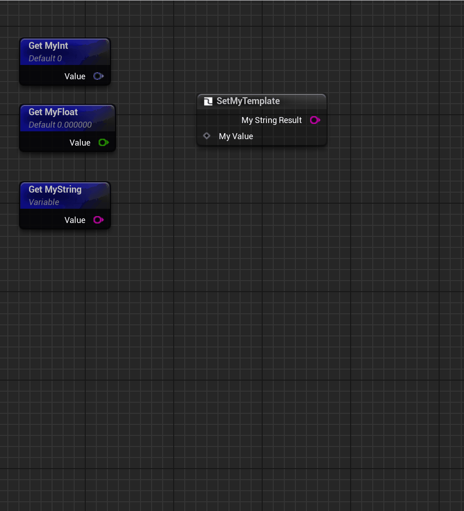

# TemplateName

- **Function description:** Designates this FRigUnit as a generic template node.
- **Usage location:** USTRUCT
- **Engine module:** RigVMStruct
- **Metadata type:** string="abc"
- **Restriction type:** FRigUnit
- **Commonly used:** ★★★

Designates this FRigUnit as a generic template node.

When different FRigUnits are assigned the same TemplateName, they analyze the complete function signature of their Input and Output properties, ultimately identifying which properties are generic pins (i.e., properties with the same name but different types). During invocation, the input is the TemplateNode, which is the node formed by the TemplateName. Pins are then manually connected to determine the final function type, thus ultimately deciding which FRigUnit node should be applied in practice.

This feature is particularly useful when implementing logic that is identical but with slightly different parameter types. Typically, FRigUnit_MyTemplate_Float and FRigUnit_MyTemplate_Int inherit from a base class (though this is not mandatory), where common logic or properties are implemented.

## Test Code:

```cpp
USTRUCT(meta = (DisplayName = "Set My float", TemplateName = "SetMyTemplate"))
struct INSIDER_API FRigUnit_MyTemplate_Float : public FRigUnit
{
	GENERATED_BODY()

	RIGVM_METHOD()
		virtual void Execute() override;
public:
	UPROPERTY(meta = (Input))
	float MyValue;

	UPROPERTY(meta = (Output))
	FString MyStringResult;
};

USTRUCT(meta = (DisplayName = "Set My int", TemplateName = "SetMyTemplate"))
struct INSIDER_API FRigUnit_MyTemplate_Int : public FRigUnit
{
	GENERATED_BODY()

	RIGVM_METHOD()
		virtual void Execute() override;
public:
	UPROPERTY(meta = (Input))
	int32 MyValue;

	UPROPERTY(meta = (Output))
	FString MyStringResult;
};
```

## Test Results:

It can be observed that the initial node is SetMyTemplate, and depending on the pin type, it is actually resolved into either FRigUnit_MyTemplate_Float or FRigUnit_MyTemplate_Int. Since SetMyString has not been implemented, the FString type cannot be connected to the pin.



## Principle:

The source code involves a considerable amount of code related to this functionality. The general logic is that when FRigUnit initializes, it registers with FRigVMRegistry. If a TemplateName is present, a FRigTemplate is created. When creating via a right-click in the blueprint, a URigTemplateNode is actually created, which is then dispatched to the actual final node by FRigDispatch.

```cpp
void FRigVMRegistry::Register(const TCHAR* InName, FRigVMFunctionPtr InFunctionPtr, UScriptStruct* InStruct, const TArray<FRigVMFunctionArgument>& InArguments)
{
	FString TemplateMetadata;
	if (InStruct->GetStringMetaDataHierarchical(TemplateNameMetaName, &TemplateMetadata))
	{
	}
}
```