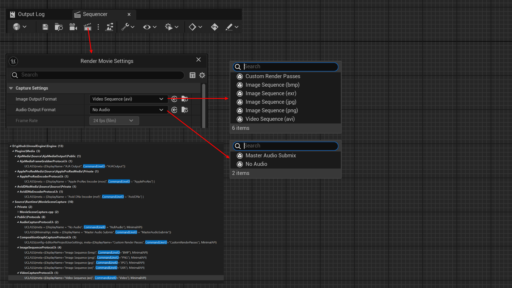

# CommandLineID

- **Function description:** Indicates the protocol type for subclasses of UMovieSceneCaptureProtocolBase.
- **Usage location:** UCLASS
- **Engine module:** Sequencer
- **Metadata type:** string="abc"
- **Restriction type:** Applicable to subclasses of UMovieSceneCaptureProtocolBase
- **Commonality:** ★★

Indicates the protocol type for subclasses of UMovieSceneCaptureProtocolBase.

Used to select the correct handler class during Sequencer rendering and export. Typically used within the engine, unless custom rendering output format protocol classes are being defined.

## Test Results:



## Principle:

In essence, it involves finding the relevant ProtocolType Class based on the chosen format name

```cpp
void UMovieSceneCapture::Initialize(TSharedPtr<FSceneViewport> InSceneViewport, int32 PIEInstance)
{
			FString ImageProtocolOverrideString;
			if (   FParse::Value( FCommandLine::Get(), TEXT( "-MovieFormat=" ), ImageProtocolOverrideString )
			|| FParse::Value( FCommandLine::Get(), TEXT( "-ImageCaptureProtocol=" ), ImageProtocolOverrideString ) )
			{
				static const TCHAR* const CommandLineIDString = TEXT("CommandLineID");
				TArray<UClass*> AllProtocolTypes = FindAllCaptureProtocolClasses();
				for (UClass* Class : AllProtocolTypes)
				{
					bool bMetaDataMatch = Class->GetMetaData(CommandLineIDString) == ImageProtocolOverrideString;
					if ( bMetaDataMatch || Class->GetName() == ImageProtocolOverrideString )
					{
						OverrideClass = Class;
					}
				}
				ImageCaptureProtocolType = OverrideClass;
			}

		if (FParse::Value( FCommandLine::Get(), TEXT( "-AudioCaptureProtocol=" ), AudioProtocolOverrideString ) )
		{
			static const TCHAR* const CommandLineIDString = TEXT("CommandLineID");
		}
	}
```