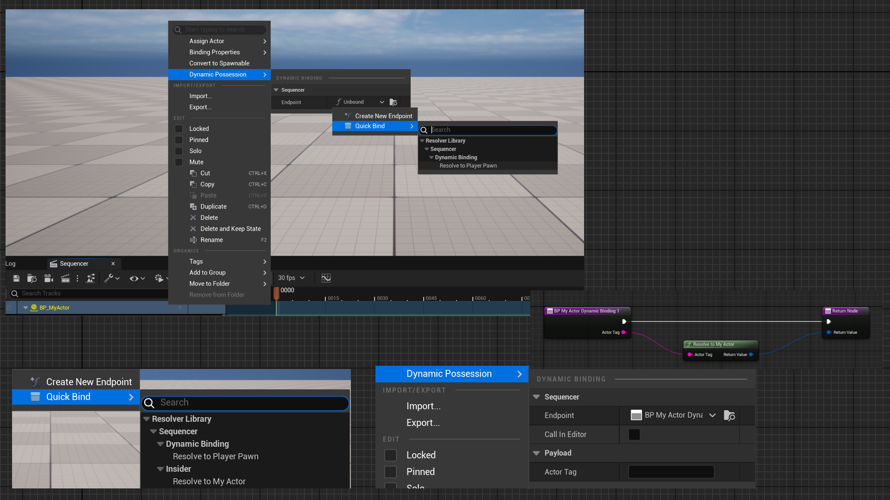

# SequencerBindingResolverLibrary

- **Function Description:** Treat UBlueprintFunctionLibrary marked with SequencerBindingResolverLibrary as a dynamically bindable class.
- **Usage Location:** UCLASS
- **Engine Module:** Sequencer
- **Metadata Type:** bool
- **Restriction Type:** Applies to UClass, but typically used with UBlueprintFunctionLibrary
- **Commonality:** ★★

Consider UBlueprintFunctionLibrary with the SequencerBindingResolverLibrary tag as dynamically bindable. Only add its functions to the context menu accessible via a right-click.

Dynamic binding is a new Sequencer feature that allows pre-set trajectory changes to be dynamically applied to other Actors at runtime. This is particularly useful for seamless transitions between Gameplay and Sequences. For a more detailed explanation of its usage, please refer to the official documentation: [https://dev.epicgames.com/documentation/zh-cn/unreal-engine/dynamic-binding-in-sequencer](https://dev.epicgames.com/documentation/zh-cn/unreal-engine/dynamic-binding-in-sequencer)

## Test Code:

```cpp
UCLASS(meta=(SequencerBindingResolverLibrary), MinimalAPI)
class UMySequencerBindingResolverLibrary : public UBlueprintFunctionLibrary
{
	GENERATED_BODY()

public:

	/** Resolve the bound object to the player's pawn */
	UFUNCTION(BlueprintPure, Category="Sequencer|Insider", meta=(WorldContext="WorldContextObject"))
	static FMovieSceneDynamicBindingResolveResult ResolveToMyActor(UObject* WorldContextObject, FString ActorTag);
};
```

Source Code:

```cpp
UCLASS(meta=(SequencerBindingResolverLibrary), MinimalAPI)
class UBuiltInDynamicBindingResolverLibrary : public UBlueprintFunctionLibrary
{
	GENERATED_BODY()

public:

	/** Resolve the bound object to the player's pawn */
	UFUNCTION(BlueprintPure, Category="Sequencer|Dynamic Binding", meta=(WorldContext="WorldContextObject"))
	static MOVIESCENE_API FMovieSceneDynamicBindingResolveResult ResolveToPlayerPawn(UObject* WorldContextObject, int32 PlayerControllerIndex = 0);
};

```

## Test Results:

Before UMySequencerBindingResolverLibrary was defined, the engine had a built-in ResolveToPlayerPawn function, which could convert the PlayerControllerIndex to a Pawn for dynamic binding to the player's Pawn.

Thus, we can also define our own dynamic binding functions to resolve an FString into an Actor, as demonstrated by the ResolveToMyActor function in the code.



## Principle:

FMovieSceneDynamicBindingCustomization searches for all classes within the engine, but to narrow down the scope, it only looks for Resolver functions under classes tagged with SequencerBindingResolverLibrary.

```cpp
void FMovieSceneDynamicBindingCustomization::CollectResolverLibraryBindActions(UBlueprint* Blueprint, FBlueprintActionMenuBuilder& MenuBuilder, bool bIsRebinding)
{
	// Add any class that has the "SequencerBindingResolverLibrary" meta as a target class.
//
// We don't consider *all* blueprint function libraries because there are many, many of them that expose
// functions that are, technically speaking, compatible with bound object resolution (i.e. they return
// a UObject pointer) but that are completely non-sensical in this context.
const static FName SequencerBindingResolverLibraryMeta("SequencerBindingResolverLibrary");
for (TObjectIterator<UClass> ClassIt; ClassIt; ++ClassIt)
{
	UClass* CurrentClass = *ClassIt;
	if (CurrentClass->HasMetaData(SequencerBindingResolverLibraryMeta))
	{
		FBlueprintActionFilter::Add(MenuFilter.TargetClasses, CurrentClass);
	}
}
}
```