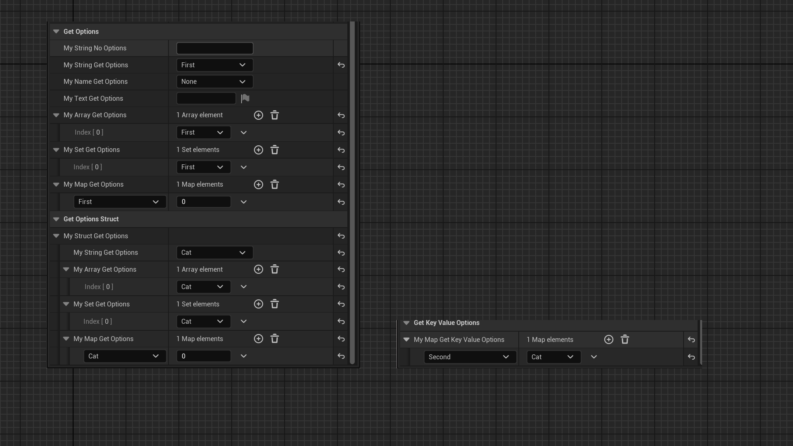

# GetOptions

- **Function Description:** Specifies a function from an external class to provide options for the FName or FString attributes, offering a list of values in the dropdown menu within the details panel.
- **Usage Locations:** UPARAM, UPROPERTY
- **Engine Module:** String/Text Property
- **Metadata Type:** string="abc"
- **Restricted Types:** FString, FName
- **Associated Items:** [GetKeyOptions](../GetKeyOptions.md), [GetValueOptions](../GetValueOptions.md)
- **Commonly Used:** ★★★★★

Specifies a function from an external class to provide options for FName or FString attributes, presenting a list of values in the dropdown menu within the details panel.

- Only affects FName or FString properties; FText is not supported.
- Also applicable to containers such as TArray, TMap, and TSet.
- Also can be used on variables within internal structures. The key point is that when searching for a function, it is done by finding OuterObject::Function, allowing even variables within internal structures to access functions from the external class. However, for another unrelated class, the "Module.Class.Function" format must be used to find it, or it will only return an empty result.
- The function prototype is TArray<FString> FuncName(), which returns a string type, even if the property type is FName, as the engine internally performs the conversion.
- The function can be a member function or a static function.

## Test Code:

```cpp
USTRUCT(BlueprintType)
struct INSIDER_API FMyOptionsTest
{
	GENERATED_BODY()
public:
	UPROPERTY(EditAnywhere, meta = (GetOptions = "MyGetOptions_Static"))
	FString MyString_GetOptions;

	UPROPERTY(EditAnywhere, meta = (GetOptions = "MyGetOptions_Static"))
	TArray<FString> MyArray_GetOptions;

	UPROPERTY(EditAnywhere, meta = (GetOptions = "MyGetOptions_Static"))
	TSet<FString> MySet_GetOptions;

	UPROPERTY(EditAnywhere, meta = (GetOptions = "MyGetOptions_Static"))
	TMap<FString, int32> MyMap_GetOptions;
};

UCLASS(BlueprintType)
class INSIDER_API UMyProperty_Text :public UObject
{
public:
	UPROPERTY(EditAnywhere, Category = GetOptions)
	FString MyString_NoOptions;

	UPROPERTY(EditAnywhere, Category = GetOptions, meta = (GetOptions = "MyGetOptions"))
	FString MyString_GetOptions;

	UPROPERTY(EditAnywhere, Category = GetOptions, meta = (GetOptions = "MyGetOptions"))
	FName MyName_GetOptions;

	UPROPERTY(EditAnywhere, Category = GetOptions, meta = (GetOptions = "MyGetOptions"))
	FText MyText_GetOptions;

	UPROPERTY(EditAnywhere, Category = GetOptions, meta = (GetOptions = "MyGetOptions"))
	TArray<FString> MyArray_GetOptions;

	UPROPERTY(EditAnywhere, Category = GetOptions, meta = (GetOptions = "MyGetOptions"))
	TSet<FString> MySet_GetOptions;

	UPROPERTY(EditAnywhere, Category = GetOptions, meta = (GetOptions = "MyGetOptions"))
	TMap<FString, int32> MyMap_GetOptions;

	UFUNCTION()
	static TArray<FString> MyGetOptions_Static() { return TArray<FString>{"Cat", "Dog"}; }

	UFUNCTION()
	TArray<FString> MyGetOptions() { return TArray<FString>{"First", "Second", "Third"}; }
public:
	UPROPERTY(EditAnywhere, Category = GetOptionsStruct)
	FMyOptionsTest MyStruct_GetOptions;
public:
	UPROPERTY(EditAnywhere, Category = GetKeyValueOptions, meta = (GetKeyOptions = "MyGetOptions",GetValueOptions="MyGetOptions_Static"))
	TMap<FString, FName> MyMap_GetKeyValueOptions;
}
```

## Test Results:

As shown in the figure below, FText does not take effect. All other properties marked with GetOptions have a dropdown menu in the details panel.

When using TMap, you can also use GetKeyOptions and GetValueOptions to provide different option lists for the Key and Value respectively, as seen in MyMap_GetKeyValueOptions.



## Principle:

The general process involves using GetPropertyOptionsMetaDataKey to determine if a property supports option box editing, then calling

GetPropertyOptions to invoke the specified function to obtain the option list, and finally building the ComboBoxWidget based on the values in this list.

```cpp
	void PropertyEditorUtils::GetPropertyOptions(TArray<UObject*>& InOutContainers, FString& InOutPropertyPath,
		TArray<TSharedPtr<FString>>& InOutOptions)
	{
		// Check for external function references
		if (InOutPropertyPath.Contains(TEXT(".")))
		{
			InOutContainers.Empty();
			UFunction* GetOptionsFunction = FindObject<UFunction>(nullptr, *InOutPropertyPath, true);

			if (ensureMsgf(GetOptionsFunction && GetOptionsFunction->HasAnyFunctionFlags(EFunctionFlags::FUNC_Static), TEXT("Invalid GetOptions: %s"), *InOutPropertyPath))
			{
				UObject* GetOptionsCDO = GetOptionsFunction->GetOuterUClass()->GetDefaultObject();
				GetOptionsFunction->GetName(InOutPropertyPath);
				InOutContainers.Add(GetOptionsCDO);
			}
		}

		if (InOutContainers.Num() > 0)
		{
			TArray<FString> OptionIntersection;
			TSet<FString> OptionIntersectionSet;

			for (UObject* Target : InOutContainers)
			{
				TArray<FString> StringOptions;
				{
					FEditorScriptExecutionGuard ScriptExecutionGuard;

					FCachedPropertyPath Path(InOutPropertyPath);
					if (!PropertyPathHelpers::GetPropertyValue(Target, Path, StringOptions))
					{
						TArray<FName> NameOptions;
						if (PropertyPathHelpers::GetPropertyValue(Target, Path, NameOptions))
						{
							Algo::Transform(NameOptions, StringOptions, [](const FName& InName) { return InName.ToString(); });
						}
					}
				}

				// If this is the first time there won't be any options.
				if (OptionIntersection.Num() == 0)
				{
					OptionIntersection = StringOptions;
					OptionIntersectionSet = TSet<FString>(StringOptions);
				}
				else
				{
					TSet<FString> StringOptionsSet(StringOptions);
					OptionIntersectionSet = StringOptionsSet.Intersect(OptionIntersectionSet);
					OptionIntersection.RemoveAll([&OptionIntersectionSet](const FString& Option){ return !OptionIntersectionSet.Contains(Option); });
				}

				// If we're out of possible intersected options, we can stop.
				if (OptionIntersection.Num() == 0)
				{
					break;
				}
			}

			Algo::Transform(OptionIntersection, InOutOptions, [](const FString& InString) { return MakeShared<FString>(InString); });
		}
	}

FName GetPropertyOptionsMetaDataKey(const FProperty* Property)
{
	// Only string and name properties can have options
	if (Property->IsA(FStrProperty::StaticClass()) || Property->IsA(FNameProperty::StaticClass()))
	{
		const FProperty* OwnerProperty = Property->GetOwnerProperty();
		static const FName GetOptionsName("GetOptions");
		if (OwnerProperty->HasMetaData(GetOptionsName))
		{
			return GetOptionsName;
		}

		// Map properties can have separate options for keys and values
		const FMapProperty* MapProperty = CastField<FMapProperty>(OwnerProperty);
		if (MapProperty)
		{
			static const FName GetKeyOptionsName("GetKeyOptions");
			if (MapProperty->HasMetaData(GetKeyOptionsName) && MapProperty->GetKeyProperty() == Property)
			{
				return GetKeyOptionsName;
			}

			static const FName GetValueOptionsName("GetValueOptions");
			if (MapProperty->HasMetaData(GetValueOptionsName) && MapProperty->GetValueProperty() == Property)
			{
				return GetValueOptionsName;
			}
		}
	}

	return NAME_None;
}

TSharedPtr<SWidget> SGraphPinString::TryBuildComboBoxWidget()
{
		PropertyEditorUtils::GetPropertyOptions(PropertyContainers, GetOptionsFunctionName, ComboBoxOptions);
}
```