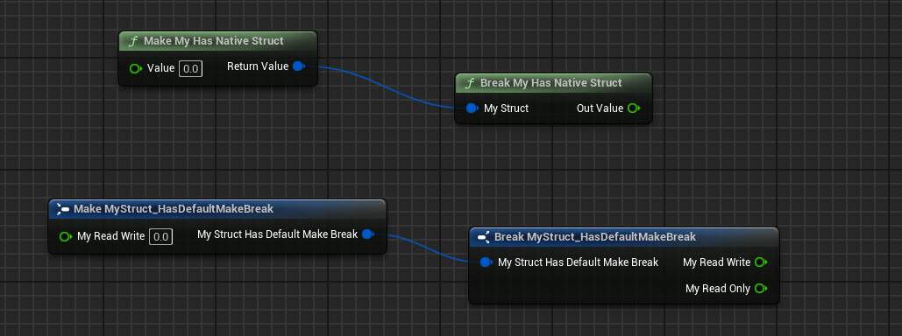

# HasNativeBreak

- **Function description:** Specifies a C++ UFunction as the implementation for the Break node within this structure
- **Use location:** USTRUCT
- **Engine module:** Struct
- **Metadata type:** string = "abc"
- **Related items:** [HasNativeMake](../HasNativeMake.md)
- **Frequency:** ★★★★★

Specifies a C++ UFunction as the implementation for the Break node within this structure

Enter the full path value for a static *UFunction, typically in the format "/*Script/*Module.Class.Function*"

This function is usually BlueprintThreadSafe, as pure Make and Break functions typically have no side effects, allowing them to be called across threads without issues.

## Test Code:

```cpp
//(BlueprintType = true, HasNativeBreak = /Script/Insider.MyHasNativeStructHelperLibrary.BreakMyHasNativeStruct, HasNativeMake = /Script/Insider.MyHasNativeStructHelperLibrary.MakeMyHasNativeStruct, ModuleRelativePath = Struct/MyStruct_NativeMakeBreak.h)
USTRUCT(BlueprintType, meta = (HasNativeBreak = "/Script/Insider.MyHasNativeStructHelperLibrary.BreakMyHasNativeStruct", HasNativeMake = "/Script/Insider.MyHasNativeStructHelperLibrary.MakeMyHasNativeStruct"))
struct INSIDER_API FMyStruct_HasNative
{
	GENERATED_BODY()

	UPROPERTY(BlueprintReadWrite, EditAnywhere)
	float MyReadWrite;
	UPROPERTY(BlueprintReadOnly, EditAnywhere)
	float MyReadOnly;
	UPROPERTY(EditAnywhere)
	float MyNotBlueprint;
};

USTRUCT(BlueprintType)
struct INSIDER_API FMyStruct_HasDefaultMakeBreak
{
	GENERATED_BODY()

	UPROPERTY(BlueprintReadWrite, EditAnywhere)
	float MyReadWrite;
	UPROPERTY(BlueprintReadOnly, EditAnywhere)
	float MyReadOnly;
	UPROPERTY(EditAnywhere)
	float MyNotBlueprint;
};

UCLASS()
class UMyHasNativeStructHelperLibrary : public UBlueprintFunctionLibrary
{
	GENERATED_BODY()
public:
	UFUNCTION(BlueprintPure, meta = (BlueprintThreadSafe))
	static void BreakMyHasNativeStruct(const FMyStruct_HasNative& myStruct, float& outValue)
	{
		outValue = myStruct.MyReadWrite + myStruct.MyReadOnly + myStruct.MyNotBlueprint;
	}

	UFUNCTION(BlueprintPure, meta = (BlueprintThreadSafe))
	static FMyStruct_HasNative MakeMyHasNativeStruct(float value)
	{
		FMyStruct_HasNative result;
		result.MyReadWrite = value;
		result.MyReadOnly = value;
		result.MyNotBlueprint = value;
		return result;
	}
};
```

## Blueprint Node:



## The principle is:

Locate the UFunction by the value configured in the Meta, thus the complete path value provided during configuration must allow the UFunction to be found. The function's signature is automatically reflected and its information extracted to the UK2Node_CallFunction node, enabling the construction of Make and Break blueprint nodes with various styles.

```cpp
E:\P4V\Engine\Source\Editor\BlueprintGraph\Private\EdGraphSchema_K2.cpp

const FString& MetaData = StructType->GetMetaData(FBlueprintMetadata::MD_NativeMakeFunction);
const UFunction* Function = FindObject<UFunction>(nullptr, *MetaData, true);

UK2Node_CallFunction* CallFunctionNode;

if (Params.bTransient || Params.CompilerContext)
{
	CallFunctionNode = (Params.bTransient ? NewObject<UK2Node_CallFunction>(Graph) : Params.CompilerContext->SpawnIntermediateNode<UK2Node_CallFunction>(GraphNode, Params.SourceGraph));
	CallFunctionNode->SetFromFunction(Function);
	CallFunctionNode->AllocateDefaultPins();
}
else
{
	FGraphNodeCreator<UK2Node_CallFunction> MakeStructCreator(*Graph);
	CallFunctionNode = MakeStructCreator.CreateNode(false);
	CallFunctionNode->SetFromFunction(Function);
	MakeStructCreator.Finalize();
}

SplitPinNode = CallFunctionNode;
```