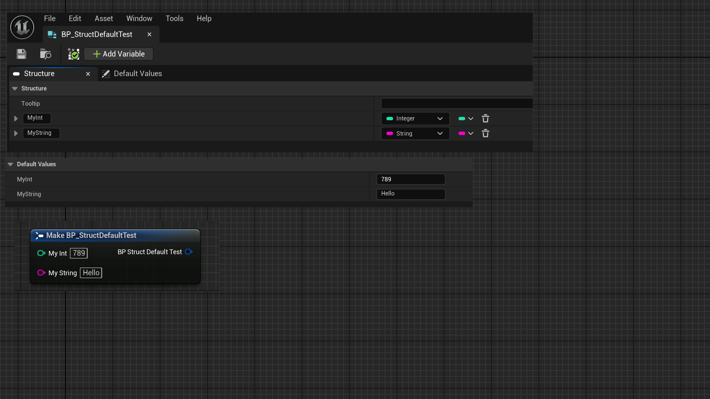

# MakeStructureDefaultValue

- **Function Description:** Stores the default values for attributes within custom structures in BP.
- **Usage Location:** UPROPERTY
- **Engine Module:** Struct
- **Metadata Type:** bool
- **Restriction Type:** User-defined Struct in BP
- **Commonality:** ★

Stores the default values of attributes in custom structures within BP.

- In C++, the default values for attributes in the USTRUCT we define do not need to be saved in metadata, as the structure's constructor is automatically called when an instance is created, thus properly initializing the values.
- However, user-defined structures in Blueprints lack a constructor mechanism. Therefore, we require a dedicated tab for entering default attribute values. These default values are then stored in the attribute's metadata.
-

## Test Code:

Define a structure named BP_StructDefaultTest in the blueprint and populate it with default values.



## Test Results:

Print the relevant information using the test command line. You will see the actual property names of MyInt and MyString, as well as the value of MakeStructureDefaultValue.

```cpp
[struct BP_StructDefaultTest	UserDefinedStruct->ScriptStruct->Struct->Field->Object	/Game/Struct/BP_StructDefaultTest.BP_StructDefaultTest]
(BlueprintType = true, Tooltip = )
	ObjectFlags:	RF_Public | RF_Standalone | RF_Transactional | RF_WasLoaded | RF_LoadCompleted
	Outer:	Package /Game/Struct/BP_StructDefaultTest
StructFlags:	STRUCT_NoFlags
Size:	24
{
	(DisplayName = MyInt, Tooltip = , MakeStructureDefaultValue = 789)
	0-[4] int32 MyInt_3_CC664A574A072369083883B38EA2F129;
		PropertyFlags:	CPF_Edit | CPF_BlueprintVisible | CPF_ZeroConstructor | CPF_IsPlainOldData | CPF_NoDestructor | CPF_HasGetValueTypeHash
		ObjectFlags:	RF_Public | RF_LoadCompleted
		Outer:	UserDefinedStruct /Game/Struct/BP_StructDefaultTest.BP_StructDefaultTest
		Path:	IntProperty /Game/Struct/BP_StructDefaultTest.BP_StructDefaultTest:MyInt_3_CC664A574A072369083883B38EA2F129
	(DisplayName = MyString, Tooltip = , MakeStructureDefaultValue = Hello)
	8-[16] FString MyString_6_D8FAF5D6454C781C2D5175ACF266C394;
		PropertyFlags:	CPF_Edit | CPF_BlueprintVisible | CPF_ZeroConstructor | CPF_HasGetValueTypeHash
		ObjectFlags:	RF_Public | RF_LoadCompleted
		Outer:	UserDefinedStruct /Game/Struct/BP_StructDefaultTest.BP_StructDefaultTest
		Path:	StrProperty /Game/Struct/BP_StructDefaultTest.BP_StructDefaultTest:MyString_6_D8FAF5D6454C781C2D5175ACF266C394
};
```

## Principle:

When a structure is created and saved in the blueprint, if a default value is not empty, it will be assigned to MakeStructureDefaultValue. This value can then be used during the MakeStruct operation.

```cpp
void UK2Node_MakeStruct::FMakeStructPinManager::CustomizePinData(UEdGraphPin* Pin, FName SourcePropertyName, int32 ArrayIndex, FProperty* Property) const
{
	const FString& MetadataDefaultValue = Property->GetMetaData(TEXT("MakeStructureDefaultValue"));
if (!MetadataDefaultValue.IsEmpty())
{
	Schema->SetPinAutogeneratedDefaultValue(Pin, MetadataDefaultValue);
	return;
}
}

static void FUserDefinedStructureCompilerInner::CreateVariables(UUserDefinedStruct* Struct, const class UEdGraphSchema_K2* Schema, FCompilerResultsLog& MessageLog)
{
	if (!VarDesc.DefaultValue.IsEmpty())
	{
		VarProperty->SetMetaData(TEXT("MakeStructureDefaultValue"), *VarDesc.DefaultValue);
	}
}
```