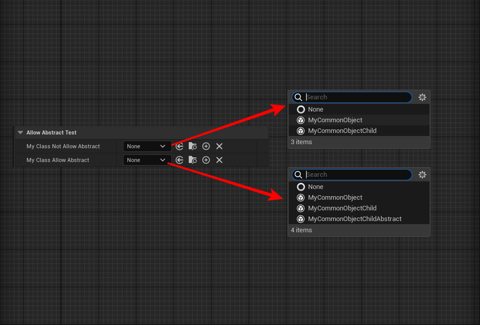

# AllowAbstract

- **Function Description:** Used for class attributes to indicate whether abstract classes are accepted.
- **Placement:** UPARAM, UPROPERTY
- **Engine Module:** TypePicker
- **Metadata Type:** bool
- **Restricted Types:** TSubClassOf, FSoftClassPath, UClass*
- **Commonality:** ★★

## Test Code:

```cpp
UCLASS(Blueprintable, BlueprintType)
class INSIDER_API UMyCommonObject :public UObject
{
	GENERATED_BODY()
};

UCLASS(BlueprintType)
class INSIDER_API UMyCommonObjectChild :public UMyCommonObject
{
	GENERATED_BODY()
};

UCLASS(BlueprintType,Abstract)
class INSIDER_API UMyCommonObjectChildAbstract :public UMyCommonObject
{
	GENERATED_BODY()
public:
};

public:
	UPROPERTY(EditAnywhere, BlueprintReadWrite, Category = "AllowAbstractTest")
	TSubclassOf<UMyCommonObject> MyClass_NotAllowAbstract;

	UPROPERTY(EditAnywhere, BlueprintReadWrite, Category = "AllowAbstractTest", meta = (AllowAbstract))
	TSubclassOf<UMyCommonObject> MyClass_AllowAbstract;
```

## Test Results:

Visible addition of the abstract class UMyCommonObjectChildAbstract to the class selector with the AllowAbstract attribute.



## Principle:

One of the determinations involves the IsEditInlineClassAllowed check, which includes the bAllowAbstract flag.

```cpp
bool FPropertyHandleBase::GeneratePossibleValues(TArray<FString>& OutOptionStrings, TArray< FText >& OutToolTips, TArray<bool>& OutRestrictedItems, TArray<FText>* OutDisplayNames)
{
	 if( Property->IsA(FClassProperty::StaticClass()) || Property->IsA(FSoftClassProperty::StaticClass()) )
	{
		UClass* MetaClass = Property->IsA(FClassProperty::StaticClass())
			? CastFieldChecked<FClassProperty>(Property)->MetaClass
			: CastFieldChecked<FSoftClassProperty>(Property)->MetaClass;

		FString NoneStr( TEXT("None") );
		OutOptionStrings.Add( NoneStr );
		if (OutDisplayNames)
		{
			OutDisplayNames->Add(FText::FromString(NoneStr));
		}

		const bool bAllowAbstract = Property->GetOwnerProperty()->HasMetaData(TEXT("AllowAbstract"));
		const bool bBlueprintBaseOnly = Property->GetOwnerProperty()->HasMetaData(TEXT("BlueprintBaseOnly"));
		const bool bAllowOnlyPlaceable = Property->GetOwnerProperty()->HasMetaData(TEXT("OnlyPlaceable"));
		UClass* InterfaceThatMustBeImplemented = Property->GetOwnerProperty()->GetClassMetaData(TEXT("MustImplement"));

		if (!bAllowOnlyPlaceable || MetaClass->IsChildOf<AActor>())
		{
			for (TObjectIterator<UClass> It; It; ++It)
			{
				if (It->IsChildOf(MetaClass)
					&& PropertyEditorHelpers::IsEditInlineClassAllowed(*It, bAllowAbstract)
					&& (!bBlueprintBaseOnly || FKismetEditorUtilities::CanCreateBlueprintOfClass(*It))
					&& (!InterfaceThatMustBeImplemented || It->ImplementsInterface(InterfaceThatMustBeImplemented))
					&& (!bAllowOnlyPlaceable || !It->HasAnyClassFlags(CLASS_Abstract | CLASS_NotPlaceable)))
				{
					OutOptionStrings.Add(It->GetName());
					if (OutDisplayNames)
					{
						OutDisplayNames->Add(FText::FromString(It->GetName()));
					}
				}
			}
		}
	}
}

bool IsEditInlineClassAllowed( UClass* CheckClass, bool bAllowAbstract )
{
	return !CheckClass->HasAnyClassFlags(CLASS_Hidden|CLASS_HideDropDown|CLASS_Deprecated)
		&&	(bAllowAbstract || !CheckClass->HasAnyClassFlags(CLASS_Abstract));
}
```