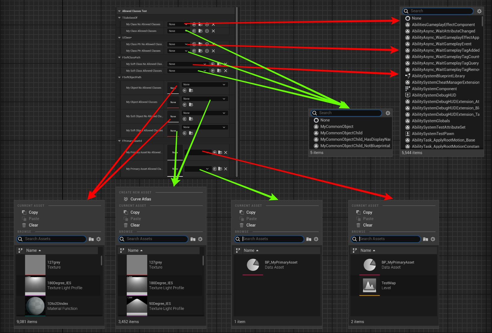
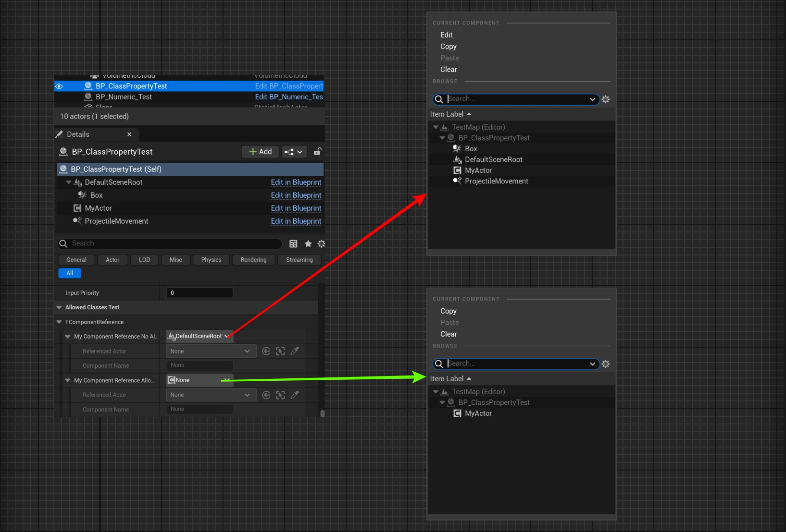

# AllowedClasses

- **Function description:** Used on class or object selectors to specify that the selected object must belong to certain base class types.
- **Use location:** UPROPERTY
- **Engine module:** TypePicker
- **Metadata type:** strings = "a, b, c"
- **Restriction types:** TSubClassOf, UClass*, FSoftClassPath, UObject*, FSoftObjectPath, FPrimaryAssetId, FComponentReference,
- **Associated items:** [ExactClass](../ExactClass/ExactClass.md), [DisallowedClasses](../DisallowedClasses/DisallowedClasses.md), [GetAllowedClasses](../GetAllowedClasses/GetAllowedClasses.md), [GetDisallowedClasses](../GetDisallowedClasses/GetDisallowedClasses.md)
- **Commonly used:** ★★★

Used on class or object selectors to specify that the selected objects must belong to certain base class types.

- The applicable attributes for class selectors are: TSubClassOf, UClass*, FSoftClassPath. Attributes that cannot be applied are: UScriptStruct*
- The applicable attributes for object selectors are: UObject*, FSoftObjectPath, FPrimaryAssetId, FComponentReference
- These selectors often display a long list of object resources for selection, thus AllowedClasses can be used to restrict the types they must belong to.
- AllowedClasses can separate multiple types with commas, allowing simultaneous support for multiple type filters.

## Test code:

```cpp
public:
	UPROPERTY(EditAnywhere, BlueprintReadWrite, Category = "AllowedClassesTest|TSubclassOf")
	TSubclassOf<UObject> MyClass_NoAllowedClasses;

	UPROPERTY(EditAnywhere, BlueprintReadWrite, Category = "AllowedClassesTest|TSubclassOf", meta = (AllowedClasses = "MyCommonObject"))
	TSubclassOf<UObject> MyClass_AllowedClasses;

	UPROPERTY(EditAnywhere, BlueprintReadWrite, Category = "AllowedClassesTest|UClass*")
	UClass* MyClassPtr_NoAllowedClasses;

	UPROPERTY(EditAnywhere, BlueprintReadWrite, Category = "AllowedClassesTest|UClass*", meta = (AllowedClasses = "MyCommonObject"))
	UClass* MyClassPtr_AllowedClasses;

	UPROPERTY(EditAnywhere, BlueprintReadWrite, Category = "AllowedClassesTest|FSoftClassPath")
	FSoftClassPath MySoftClass_NoAllowedClasses;

	UPROPERTY(EditAnywhere, BlueprintReadWrite, Category = "AllowedClassesTest|FSoftClassPath", meta = (AllowedClasses = "MyCommonObject"))
	FSoftClassPath MySoftClass_AllowedClasses;


public:
	UPROPERTY(EditAnywhere, BlueprintReadWrite, Category = "AllowedClassesTest|FSoftObjectPath")
	UObject* MyObject_NoAllowedClasses;

	UPROPERTY(EditAnywhere, BlueprintReadWrite, Category = "AllowedClassesTest|FSoftObjectPath", meta = (AllowedClasses = "/Script/Engine.Texture2D"))
	UObject* MyObject_AllowedClasses;

	UPROPERTY(EditAnywhere, BlueprintReadWrite, Category = "AllowedClassesTest|FSoftObjectPath")
	FSoftObjectPath MySoftObject_NoAllowedClasses;

	UPROPERTY(EditAnywhere, BlueprintReadWrite, Category = "AllowedClassesTest|FSoftObjectPath", meta = (AllowedClasses = "/Script/Engine.Texture2D"))
	FSoftObjectPath MySoftObject_AllowedClasses;

	UPROPERTY(EditAnywhere, BlueprintReadWrite, Category = "AllowedClassesTest|FPrimaryAssetId")
	FPrimaryAssetId MyPrimaryAsset_NoAllowedClasses;

	UPROPERTY(EditAnywhere, BlueprintReadWrite, Category = "AllowedClassesTest|FPrimaryAssetId", meta = (AllowedClasses = "MyPrimaryDataAsset"))
	FPrimaryAssetId MyPrimaryAsset_AllowedClasses;


UCLASS(Blueprintable,BlueprintType)
class INSIDER_API AMyActor_Class :public AActor
{
	GENERATED_BODY()
public:
	UPROPERTY(EditInstanceOnly, BlueprintReadWrite, Category = "AllowedClassesTest|FComponentReference", meta = (UseComponentPicker))
	FComponentReference MyComponentReference_NoAllowedClasses;

	UPROPERTY(EditInstanceOnly, BlueprintReadWrite, Category = "AllowedClassesTest|FComponentReference", meta = (UseComponentPicker,AllowedClasses = "MyActorComponent"))
	FComponentReference MyComponentReference_AllowedClasses;
};

UCLASS(BlueprintType)
class INSIDER_API UMyPrimaryDataAsset :public UPrimaryDataAsset
{}
```

## Test results:

- On the class selector, it is evident that after adding AllowedClasses, the selection is restricted to the subclasses of MyCommonObject.
- After adding AllowedClasses = "/Script/Engine.Texture2D" to the object selector, the type is restricted to textures.
- In the asset filtering for the FPrimaryAssetId attribute, after adding AllowedClasses, it can be restricted to the MyPrimaryDataAsset type, as seen in the BP_MyPrimaryAsset. Note that UMyPrimaryDataAsset needs to be configured in ProjectSettings.



Testing the effect of FComponentReference:

With the above code, it is clear that by default, the selection range for FComponentReference is all components under the current Actor. By adding AllowedClasses, the selection range can be limited to the MyActorComponent described in the code.



## Principle:

In the source code, it is often seen that in various Customization or SPropertyEditorXXX types, there is a judgment of AllowedClasses and DisallowedClasses, followed by a type filter using IsChildOf.

```cpp
void FPrimaryAssetIdCustomization::CustomizeHeader(TSharedRef<class IPropertyHandle> InStructPropertyHandle, class FDetailWidgetRow& HeaderRow, IPropertyTypeCustomizationUtils& StructCustomizationUtils)
{
	AllowedClasses = PropertyCustomizationHelpers::GetClassesFromMetadataString(StructPropertyHandle->GetMetaData("AllowedClasses"));
	DisallowedClasses = PropertyCustomizationHelpers::GetClassesFromMetadataString(StructPropertyHandle->GetMetaData("DisallowedClasses"));
}
void FComponentReferenceCustomization::BuildClassFilters()
{
		const FString& AllowedClassesFilterString = PropertyHandle->GetMetaData(NAME_AllowedClasses);
		ParseClassFilters(AllowedClassesFilterString, AllowedActorClassFilters, AllowedComponentClassFilters);

		const FString& DisallowedClassesFilterString = PropertyHandle->GetMetaData(NAME_DisallowedClasses);
		ParseClassFilters(DisallowedClassesFilterString, DisallowedActorClassFilters, DisallowedComponentClassFilters);
}
void FSoftClassPathCustomization::CustomizeHeader(TSharedRef<IPropertyHandle> InPropertyHandle, FDetailWidgetRow& HeaderRow, IPropertyTypeCustomizationUtils& StructCustomizationUtils)
{
		TArray<const UClass*> AllowedClasses = PropertyCustomizationHelpers::GetClassesFromMetadataString(PropertyHandle->GetMetaData("AllowedClasses"));
		TArray<const UClass*> DisallowedClasses = PropertyCustomizationHelpers::GetClassesFromMetadataString(PropertyHandle->GetMetaData("DisallowedClasses"));
}

void PropertyEditorUtils::GetAllowedAndDisallowedClasses(const TArray<UObject*>& ObjectList, const FProperty& MetadataProperty, TArray<const UClass*>& AllowedClasses, TArray<const UClass*>& DisallowedClasses, bool bExactClass, const UClass* ObjectClass)
{
		AllowedClasses = PropertyCustomizationHelpers::GetClassesFromMetadataString(MetadataProperty.GetOwnerProperty()->GetMetaData("AllowedClasses"));
		DisallowedClasses = PropertyCustomizationHelpers::GetClassesFromMetadataString(MetadataProperty.GetOwnerProperty()->GetMetaData("DisallowedClasses"));
		if (MetadataProperty.GetOwnerProperty()->HasMetaData("GetAllowedClasses"))
		{
			const FString GetAllowedClassesFunctionName = MetadataProperty.GetOwnerProperty()->GetMetaData("GetAllowedClasses");
		}

		if (MetadataProperty.GetOwnerProperty()->HasMetaData("GetDisallowedClasses"))
		{
			const FString GetDisallowedClassesFunctionName = MetadataProperty.GetOwnerProperty()->GetMetaData("GetDisallowedClasses");
		}
}

void SPropertyEditorAsset::InitializeClassFilters(const FProperty* Property)
{
		PropertyEditorUtils::GetAllowedAndDisallowedClasses(ObjectList, *MetadataProperty, AllowedClassFilters, DisallowedClassFilters, bExactClass, ObjectClass);
}

void SPropertyEditorClass::Construct(const FArguments& InArgs, const TSharedPtr< FPropertyEditor >& InPropertyEditor)
{
		PropertyEditorUtils::GetAllowedAndDisallowedClasses(ObjectList, *Property, AllowedClassFilters, DisallowedClassFilters, false);
}

TSharedRef<SWidget> SPropertyEditorEditInline::GenerateClassPicker()
{
		PropertyEditorUtils::GetAllowedAndDisallowedClasses(ObjectList, *Property, AllowedClassFilters, DisallowedClassFilters, false);
}
```