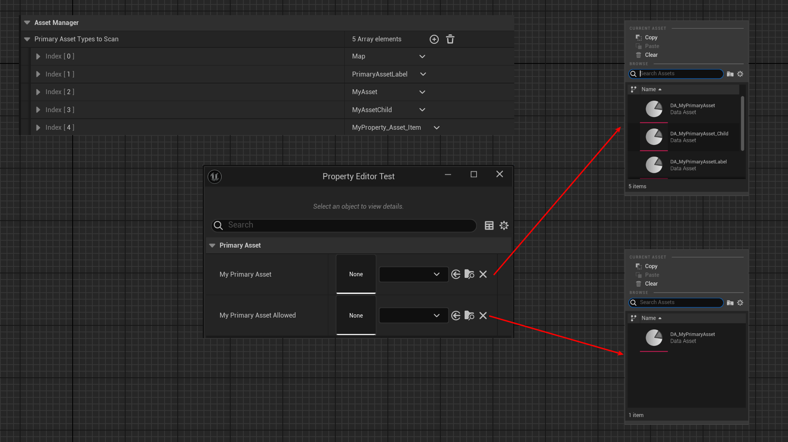

# AllowedTypes

- **Function Description:** Specifies allowable asset types for FPrimaryAssetId.
- **Usage Location:** UPROPERTY
- **Engine Module:** TypePicker
- **Metadata Type:** strings = "a, b, c"
- **Restriction Type:** FPrimaryAssetId
- **Commonality:** ★★★

Allowed asset types can be specified for FPrimaryAssetId.

## Test Code:

```cpp
UCLASS(BlueprintType)
class INSIDER_API UMyProperty_PrimaryAsset :public UObject
{
	GENERATED_BODY()
public:
	UPROPERTY(EditAnywhere, BlueprintReadWrite, Category = "PrimaryAsset")
	FPrimaryAssetId MyPrimaryAsset;

	UPROPERTY(EditAnywhere, BlueprintReadWrite, Category = "PrimaryAsset",meta=(AllowedTypes="MyAsset"))
	FPrimaryAssetId MyPrimaryAsset_Allowed;
};

```

## Test Results:

Several UPrimaryDataAssets have been predefined in the project and are also configured in ProjectSettings. (Refer to other articles for details on how to define them.)

Only one option is available for MyPrimaryAsset_Allowed, indicating that it is subject to restrictions.



## Principle:

In the customization of FPrimaryAssetIdCustomization for FPrimaryAssetId, the tag is inspected, the value of AllowedTypes is parsed, and it is set to the member variable AllowedTypes, ultimately achieving the filtering effect.

```cpp
TArray<FPrimaryAssetType> FPrimaryAssetIdCustomization::AllowedTypes;

void FPrimaryAssetIdCustomization::CustomizeHeader(TSharedRef<class IPropertyHandle> InStructPropertyHandle, class FDetailWidgetRow& HeaderRow, IPropertyTypeCustomizationUtils& StructCustomizationUtils)
{
	check(UAssetManager::IsInitialized());

	StructPropertyHandle = InStructPropertyHandle;

	const FString& TypeFilterString = StructPropertyHandle->GetMetaData("AllowedTypes");
	if( !TypeFilterString.IsEmpty() )
	{
		TArray<FString> CustomTypeFilterNames;
		TypeFilterString.ParseIntoArray(CustomTypeFilterNames, TEXT(","), true);

		for(auto It = CustomTypeFilterNames.CreateConstIterator(); It; ++It)
		{
			const FString& TypeName = *It;

			AllowedTypes.Add(*TypeName);
		}
	}

	IAssetManagerEditorModule::MakePrimaryAssetIdSelector(
	FOnGetPrimaryAssetDisplayText::CreateSP(this, &FPrimaryAssetIdCustomization::GetDisplayText),
	FOnSetPrimaryAssetId::CreateSP(this, &FPrimaryAssetIdCustomization::OnIdSelected),
	bAllowClear, AllowedTypes, AllowedClasses, DisallowedClasses)

	}
```