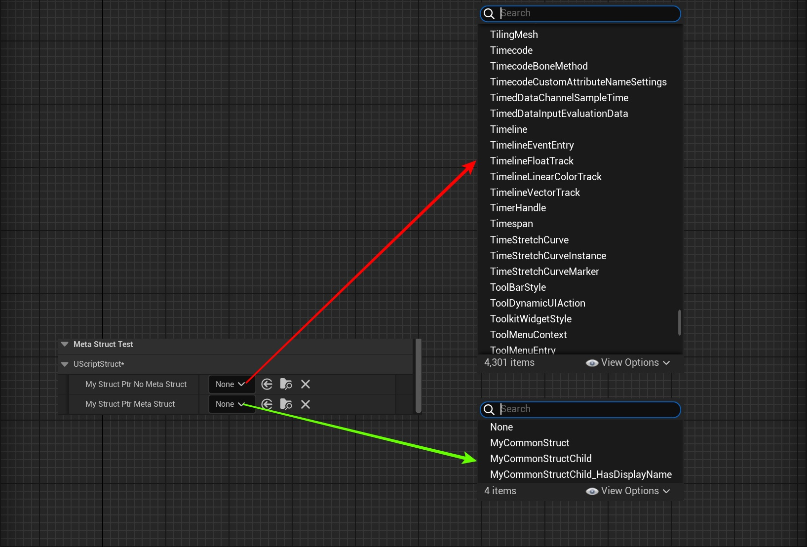

# MetaStruct

- **Function Description:** Specifies the parent structure of the chosen type when set to a UScriptStruct* attribute.
- **Usage Location:** UPROPERTY
- **Engine Module:** TypePicker
- **Metadata Type:** string="abc"
- **Restricted Type:** UScriptStruct*
- **Commonality:** ★★★

Sets the parent structure of the selected type when assigned to a UScriptStruct* attribute.

## Test Code:

```cpp
	UPROPERTY(EditAnywhere, BlueprintReadWrite, Category = "MetaStructTest|UScriptStruct*", meta = ())
	UScriptStruct* MyStructPtr_NoMetaStruct;

	UPROPERTY(EditAnywhere, BlueprintReadWrite, Category = "MetaStructTest|UScriptStruct*", meta = (MetaStruct = "MyCommonStruct"))
	UScriptStruct* MyStructPtr_MetaStruct;
```

## Test Results:

Entities with MetaStruct can filter the type list down to subclasses of MyCommonStruct.



## Principle:

Locate the MetaStruct and set it to the MetaStruct on StructFilter for filtering. This defines the base class for the selection of structures.

```cpp
void SPropertyEditorStruct::Construct(const FArguments& InArgs, const TSharedPtr< class FPropertyEditor >& InPropertyEditor)
{
		const FString& MetaStructName = Property->GetOwnerProperty()->GetMetaData(TEXT("MetaStruct"));
		if (!MetaStructName.IsEmpty())
		{
						MetaStruct = UClass::TryFindTypeSlow<UScriptStruct>(MetaStructName, EFindFirstObjectOptions::EnsureIfAmbiguous);
						if (!MetaStruct)
						{
							MetaStruct = LoadObject<UScriptStruct>(nullptr, *MetaStructName);
						}
		}
}

virtual bool FPropertyEditorStructFilter::IsStructAllowed(const FStructViewerInitializationOptions& InInitOptions, const UScriptStruct* InStruct, TSharedRef<FStructViewerFilterFuncs> InFilterFuncs) override
{
	if (InStruct->IsA<UUserDefinedStruct>())
	{
		// User Defined Structs don't support inheritance, so only include them if we have don't a MetaStruct set
		return MetaStruct == nullptr;
	}

	// Query the native struct to see if it has the correct parent type (if any)
	return !MetaStruct || InStruct->IsChildOf(MetaStruct);
}
```