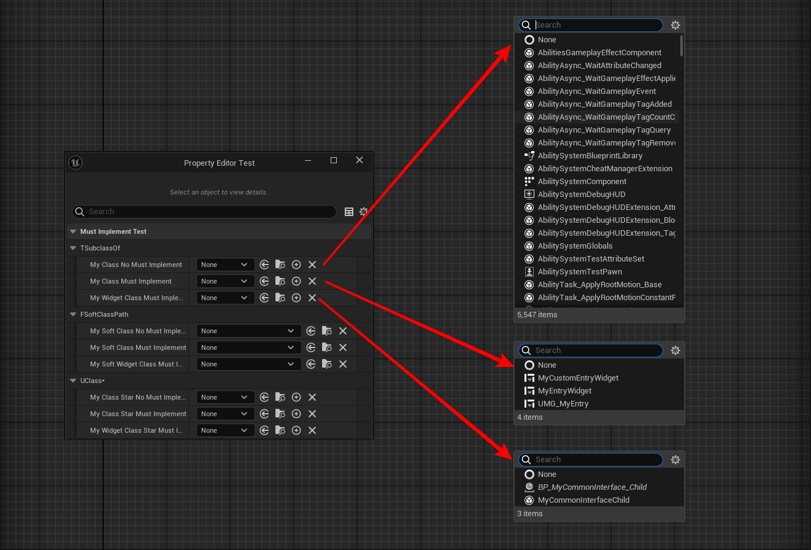

# MustImplement

- **Function Description:** Specifies that the class selected by the TSubClassOf or FSoftClassPath attribute must implement this interface
- **Usage Location:** UPROPERTY
- **Engine Module:** TypePicker
- **Metadata Type:** string="abc"
- **Restricted Types:** TSubClassOf, FSoftClassPath, UClass*
- **Commonality:** ★★★

The class specified by the TSubClassOf or FSoftClassPath attribute must implement this interface.

- TSubClassOf, FSoftClassPath, and the original UClass* attributes can all be used to locate a UClass*, with the distinction that UClass* is a hard reference to a specific class object, while FSoftClassPath is a soft reference to the path of the class object. Both, however, are general references to UClass* and do not constrain subtypes. TSubClassOf<T>, on the other hand, although it is also a hard reference to a class object, further restricts the selection of types to subclasses of T, which can be more convenient, especially when you are aware of the range of your subclasses, such as TSubClassOf<AActor> or TSubClassOf<UUserWidget>.
- For attributes used to select a class, if there are no restrictions, the engine will search for all classes, allowing you to choose from them, which is not very convenient.
- Therefore, additional filtering mechanisms have been introduced into the engine. MustImplement is used to filter and ensure that a specified class attribute must implement a certain interface.

## Test Code:

```cpp
UCLASS(BlueprintType)
class INSIDER_API UMyCommonInterfaceChild :public UObject, public IMyCommonInterface
{
	GENERATED_BODY()
};

UPROPERTY(EditAnywhere, BlueprintReadWrite, Category = "MustImplementTest|TSubclassOf")
TSubclassOf<UObject> MyClass_NoMustImplement;

UPROPERTY(EditAnywhere, BlueprintReadWrite, Category = "MustImplementTest|TSubclassOf", meta = (MustImplement = "MyCommonInterface"))
TSubclassOf<UObject> MyClass_MustImplement;

UPROPERTY(EditAnywhere, BlueprintReadWrite, Category = "MustImplementTest|TSubclassOf", meta = (MustImplement = "/Script/UMG.UserListEntry"))
TSubclassOf<UUserWidget> MyWidgetClass_MustImplement;

UPROPERTY(EditAnywhere, BlueprintReadWrite, Category = "MustImplementTest|FSoftClassPath")
FSoftClassPath MySoftClass_NoMustImplement;

UPROPERTY(EditAnywhere, BlueprintReadWrite, Category = "MustImplementTest|FSoftClassPath", meta = (MustImplement = "MyCommonInterface"))
FSoftClassPath MySoftClass_MustImplement;

UPROPERTY(EditAnywhere, BlueprintReadWrite, Category = "MustImplementTest|FSoftClassPath", meta = (MustImplement = "/Script/UMG.UserListEntry"))
FSoftClassPath MySoftWidgetClass_MustImplement;

UPROPERTY(EditAnywhere, BlueprintReadWrite, Category = "MustImplementTest|UClass*")
UClass* MyClassStar_NoMustImplement;

UPROPERTY(EditAnywhere, BlueprintReadWrite, Category = "MustImplementTest|UClass*", meta = (MustImplement = "MyCommonInterface"))
UClass* MyClassStar_MustImplement;

UPROPERTY(EditAnywhere, BlueprintReadWrite, Category = "MustImplementTest|UClass*", meta = (MustImplement = "/Script/UMG.UserListEntry"))
UClass* MyWidgetClassStar_MustImplement;

UFUNCTION(BlueprintCallable, meta=(Category="MustImplementTest|TSubclassOf"))
static void SetMyClassMustImplement(UPARAM(meta=(MustImplement="MyCommonInterface")) TSubclassOf<UObject> MNyClass){}
```

## Test Effects:

You can see the results without filtering for the first example, and the filtered results for the second and third examples.



It can also be used as a parameter within a function:


## Principle:

When FPropertyHandleBase generates potential values, you can observe that it applies a series of filters.

```cpp

void FSoftClassPathCustomization::CustomizeHeader(TSharedRef<IPropertyHandle> InPropertyHandle, FDetailWidgetRow& HeaderRow, IPropertyTypeCustomizationUtils& StructCustomizationUtils)
{
	PropertyHandle = InPropertyHandle;

	const FString& MetaClassName = PropertyHandle->GetMetaData("MetaClass");
	const FString& RequiredInterfaceName = PropertyHandle->GetMetaData("RequiredInterface"); // This was the old name, switch to MustImplement to synchronize with class property
	const FString& MustImplementName = PropertyHandle->GetMetaData("MustImplement");
	TArray<const UClass*> AllowedClasses = PropertyCustomizationHelpers::GetClassesFromMetadataString(PropertyHandle->GetMetaData("AllowedClasses"));
	TArray<const UClass*> DisallowedClasses = PropertyCustomizationHelpers::GetClassesFromMetadataString(PropertyHandle->GetMetaData("DisallowedClasses"));
	const bool bAllowAbstract = PropertyHandle->HasMetaData("AllowAbstract");
	const bool bIsBlueprintBaseOnly = PropertyHandle->HasMetaData("IsBlueprintBaseOnly") || PropertyHandle->HasMetaData("BlueprintBaseOnly");
	const bool bAllowNone = !(PropertyHandle->GetMetaDataProperty()->PropertyFlags & CPF_NoClear);
	const bool bShowTreeView = PropertyHandle->HasMetaData("ShowTreeView");
	const bool bHideViewOptions = PropertyHandle->HasMetaData("HideViewOptions");
	const bool bShowDisplayNames = PropertyHandle->HasMetaData("ShowDisplayNames");

	const UClass* const MetaClass = !MetaClassName.IsEmpty()
		? FEditorClassUtils::GetClassFromString(MetaClassName)
		: UObject::StaticClass();
	const UClass* const RequiredInterface = !RequiredInterfaceName.IsEmpty()
		? FEditorClassUtils::GetClassFromString(RequiredInterfaceName)
		: FEditorClassUtils::GetClassFromString(MustImplementName);
}

TSharedRef<SWidget> SGraphPinClass::GenerateAssetPicker()
{
		if (UEdGraphNode* ParentNode = GraphPinObj->GetOwningNode())
		{
			FString PossibleInterface = ParentNode->GetPinMetaData(GraphPinObj->PinName, TEXT("MustImplement"));
			if (!PossibleInterface.IsEmpty())
			{
				Filter->RequiredInterface = UClass::TryFindTypeSlow<UClass>(PossibleInterface);
			}
		}

}

bool FPropertyHandleBase::GeneratePossibleValues(TArray<FString>& OutOptionStrings, TArray< FText >& OutToolTips, TArray<bool>& OutRestrictedItems, TArray<FText>* OutDisplayNames)
{
	 if( Property->IsA(FClassProperty::StaticClass()) || Property->IsA(FSoftClassProperty::StaticClass()) )
	{
		UClass* MetaClass = Property->IsA(FClassProperty::StaticClass())
			? CastFieldChecked<FClassProperty>(Property)->MetaClass
			: CastFieldChecked<FSoftClassProperty>(Property)->MetaClass;

		FString NoneStr( TEXT("None") );
		OutOptionStrings.Add( NoneStr );
		if (OutDisplayNames)
		{
			OutDisplayNames->Add(FText::FromString(NoneStr));
		}

		const bool bAllowAbstract = Property->GetOwnerProperty()->HasMetaData(TEXT("AllowAbstract"));
		const bool bBlueprintBaseOnly = Property->GetOwnerProperty()->HasMetaData(TEXT("BlueprintBaseOnly"));
		const bool bAllowOnlyPlaceable = Property->GetOwnerProperty()->HasMetaData(TEXT("OnlyPlaceable"));
		UClass* InterfaceThatMustBeImplemented = Property->GetOwnerProperty()->GetClassMetaData(TEXT("MustImplement"));

		if (!bAllowOnlyPlaceable || MetaClass->IsChildOf<AActor>())
		{
			for (TObjectIterator<UClass> It; It; ++It)
			{
				if (It->IsChildOf(MetaClass)
					&& PropertyEditorHelpers::IsEditInlineClassAllowed(*It, bAllowAbstract)
					&& (!bBlueprintBaseOnly || FKismetEditorUtilities::CanCreateBlueprintOfClass(*It))
					&& (!InterfaceThatMustBeImplemented || It->ImplementsInterface(InterfaceThatMustBeImplemented))
					&& (!bAllowOnlyPlaceable || !It->HasAnyClassFlags(CLASS_Abstract | CLASS_NotPlaceable)))
				{
					OutOptionStrings.Add(It->GetName());
					if (OutDisplayNames)
					{
						OutDisplayNames->Add(FText::FromString(It->GetName()));
					}
				}
			}
		}
	}
}
```