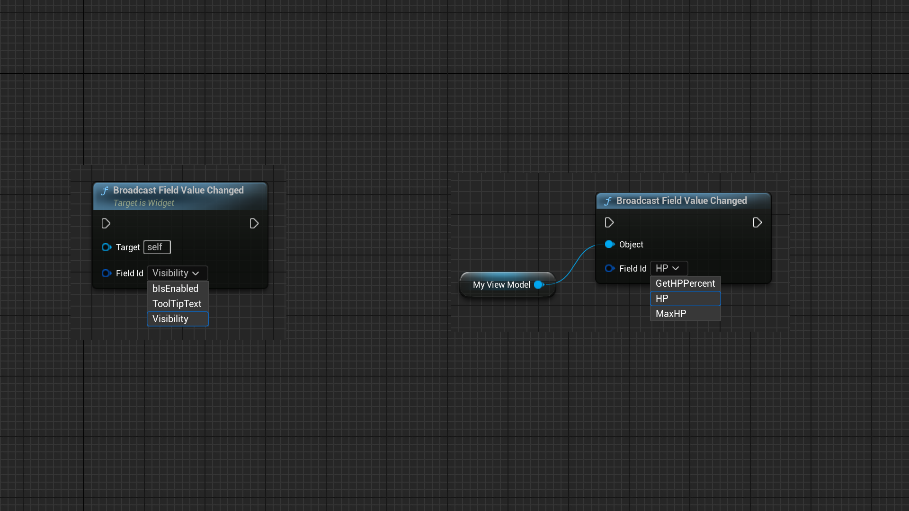

# FieldNotifyInterfaceParam

- **Function description:** Specifies that a certain parameter of the function provides information for the FieldNotify ViewModel.
- **Use location:** UFUNCTION
- **Engine module:** FieldNotify
- **Metadata type:** string="abc"
- **Restricted type:** The function contains other FFieldNotificationId parameters
- **Frequency of use:** ★★★

Specifies a parameter within the function to provide information for FieldNotify's ViewModel.

This parameter serves as context for subsequent FFieldNotificationId parameters, allowing the FieldId selection box to determine which values are available for selection.

## Source Code Example:

```cpp
	/** Broadcast that the Field value changed. */
	UFUNCTION(BlueprintCallable, Category = "FieldNotification", meta = (FieldNotifyInterfaceParam="Object", DisplayName = "Broadcast Field Value Changed"))
	static void BroadcastFieldValueChanged(UObject* Object, FFieldNotificationId FieldId);

```

## Blueprint Visualization:

When tested in a UserWidget, it is observed that if the Target parameter is not connected, it defaults to the current UserWidget, with the FieldId having three possible values. However, after connecting to a custom ViewModel, the FieldId changes to the values defined below.



## Working Principle:

```cpp
TSharedRef<SWidget> SFieldNotificationGraphPin::GetDefaultValueWidget()
{
	UEdGraphPin* SelfPin = GraphPinObj->GetOwningNode()->FindPin(UEdGraphSchema_K2::PSC_Self);
	if (UK2Node_CallFunction* CallFunction = Cast<UK2Node_CallFunction>(GraphPinObj->GetOwningNode()))
	{
		if (UFunction* Function = CallFunction->GetTargetFunction())
		{
			const FString& PinName = Function->GetMetaData("FieldNotifyInterfaceParam");
			if (PinName.Len() != 0)
			{
				SelfPin = GraphPinObj->GetOwningNode()->FindPin(*PinName);
			}
		}
	}

	return SNew(SFieldNotificationPicker)
		.Value(this, &SFieldNotificationGraphPin::GetValue)
		.OnValueChanged(this, &SFieldNotificationGraphPin::SetValue)
		.FromClass_Static(Private::GetPinClass, SelfPin)
		.Visibility(this, &SGraphPin::GetDefaultValueVisibility);
}
```