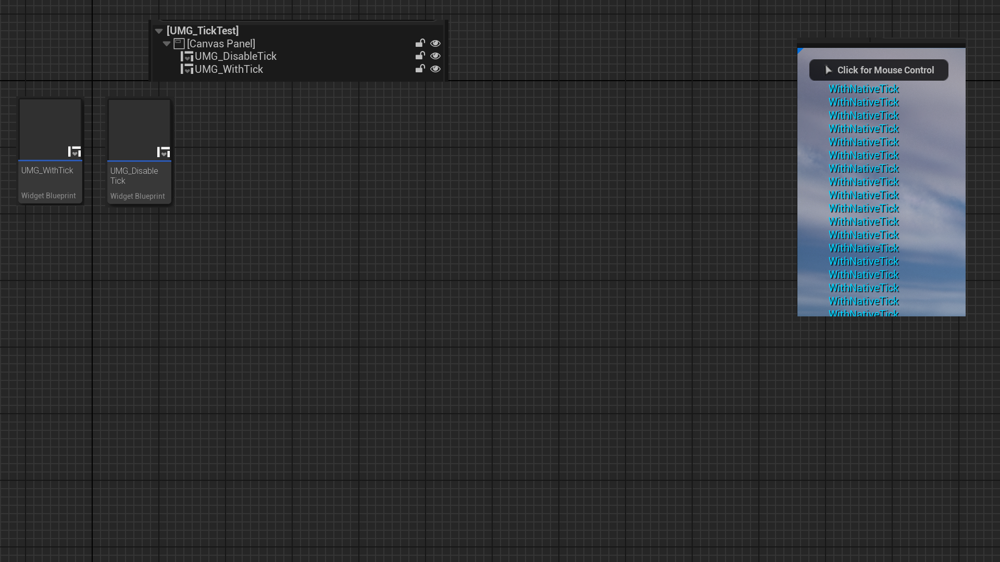

# DisableNativeTick

- **Function description:** Disable the NativeTick for this UserWidget.
- **Usage location:** UCLASS
- **Engine module:** Widget Property
- **Metadata type:** bool
- **Restriction type:** Subclass of UserWidget
- **Commonly used:** ★★★

Disable the NativeTick for this UserWidget.

Will not function if there is only a C++ class, as a pure C++ Widget lacks a WidgetBPClass.

Moreover, subclasses of BP must remove the Tick blueprint node.

## Test code:

```cpp
UCLASS(BlueprintType, meta=())
class INSIDER_API UMyWidget_WithNativeTick :public UUserWidget
{
	GENERATED_BODY()
public:
	virtual void NativeTick(const FGeometry& MyGeometry, float InDeltaTime) override
	{
		Super::NativeTick(MyGeometry, InDeltaTime);
		UKismetSystemLibrary::PrintString(nullptr, TEXT("WithNativeTick"), true);
	}
};

UCLASS(BlueprintType,meta=(DisableNativeTick))
class INSIDER_API UMyWidget_DisableNativeTick :public UUserWidget
{
	GENERATED_BODY()
public:
	virtual void NativeTick(const FGeometry& MyGeometry, float InDeltaTime) override
	{
		Super::NativeTick(MyGeometry, InDeltaTime);
		UKismetSystemLibrary::PrintString(nullptr, TEXT("DisableNativeTick"), true);
	}
};
```

## Test results:

Create the UMG_WithTick and UMG_DisableTick subclasses of UMyWidget_WithNativeTick and UMyWidget_DisableNativeTick in the blueprint, respectively. Then, add them to a UMG, place them on the screen, and observe the invocation of NativeTick.

Only UMG_WithTick will be invoked.



## Principle:

Marking the UCLASS will set the UMG blueprint's bClassRequiresNativeTick to false. This is then evaluated in the UpdateCanTick function of UUserWidget. If WidgetBPClass is not null (indicating a Blueprint subclass) and ClassRequiresNativeTick is false, bCanTick will initially be set to false. Next, checking bHasScriptImplementedTick requires that there is no EventTick in the blueprint (which is created by default and must be manually deleted). Furthermore, it must be confirmed that there are no delayed blueprint nodes and no animations. In summary, if the Widget truly has no need for a Tick, bCanTick can finally be set to false.

```cpp

void UWidgetBlueprint::UpdateTickabilityStats(bool& OutHasLatentActions, bool& OutHasAnimations, bool& OutClassRequiresNativeTick)
{
		static const FName DisableNativeTickMetaTag("DisableNativeTick");
		const bool bClassRequiresNativeTick = !NativeParent->HasMetaData(DisableNativeTickMetaTag);
		OutClassRequiresNativeTick = bClassRequiresNativeTick;

}

void FWidgetBlueprintCompilerContext::CopyTermDefaultsToDefaultObject(UObject* DefaultObject)
{
		WidgetBP->UpdateTickabilityStats(bClassOrParentsHaveLatentActions, bClassOrParentsHaveAnimations, bClassRequiresNativeTick);
		WidgetClass->SetClassRequiresNativeTick(bClassRequiresNativeTick);
}

void UUserWidget::UpdateCanTick()
{
		UWidgetBlueprintGeneratedClass* WidgetBPClass = Cast<UWidgetBlueprintGeneratedClass>(GetClass());
		bCanTick |= !WidgetBPClass || WidgetBPClass->ClassRequiresNativeTick();
		bCanTick |= bHasScriptImplementedTick;
		bCanTick |= World->GetLatentActionManager().GetNumActionsForObject(this) != 0;
		bCanTick |= ActiveSequencePlayers.Num() > 0;
		bCanTick |= QueuedWidgetAnimationTransitions.Num() > 0;
		SafeGCWidget->SetCanTick(bCanTick);
}
```