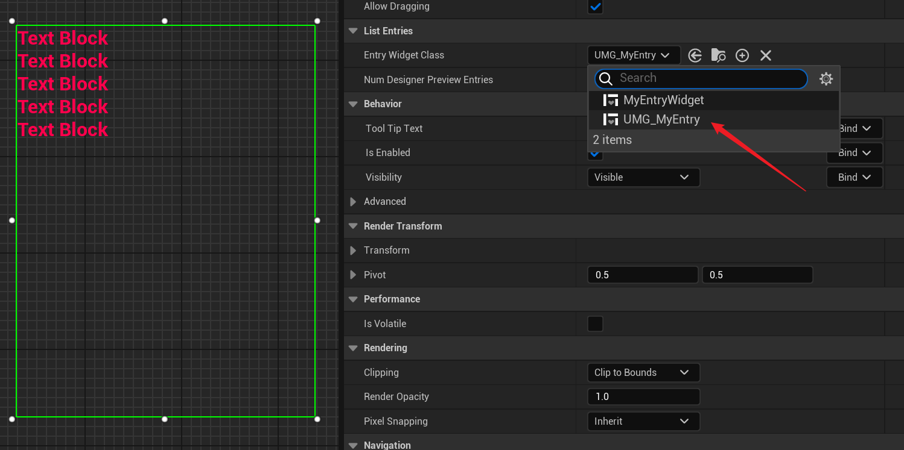

# EntryInterface

- **Function Description:** Defines the interface that optional classes for the EntryWidgetClass attribute must implement, used in both DynamicEntryBox and ListView widgets.
- **Usage Locations:** UCLASS, UPROPERTY
- **Engine Module:** Widget Property
- **Metadata Type:** string="abc"
- **Restriction Type:** Subclass of UWidget
- **Associated Items:** [EntryClass](../EntryClass.md)
- **Commonality:** ★★★

Defines the interface that optional classes for the EntryWidgetClass attribute must implement, used in both DynamicEntryBox and ListView widgets.

For example, in ListView, the term "Entry" refers to the sub-controls displayed in the list, while "Item" refers to the data elements behind the list. For instance, a list backpack may have 1000 items (Items), but only 10 controls (Entry) can be displayed on the interface simultaneously.

Therefore, EntryInterface and EntryClass, as their names imply, refer to the interface to be implemented on EntryWidget and its base class.

For demonstration of usage, the following examples use ListView, and the same applies to DynamicBox.

```cpp
//1. ListView is an attribute of another widget, so metadata extraction and validation will occur on the property.
//The property must be a BindWidget to automatically bind to the control in UMG and to be enumerated as a C++ property.
 class UMyUserWidget : public UUserWidget
 {
		UPROPERTY(BindWidget, meta = (EntryClass = MyListEntryWidget,EntryInterface = MyUserListEntry ))
		UListViewBase* MyListView;
 }

//2. If the metadata is not found on the property, it will also attempt to search directly on the Widget Class
UCLASS(meta = (EntryClass = MyListEntryWidget, EntryInterface = "/Script/UMG.UserObjectListEntry"))
class UMyListView : public UListViewBase, public ITypedUMGListView<UObject*>
{}

//3. During ClassPicker selection, EntryClass specifies the parent class, and EntryInterface specifies the interface that the class must implement
```

## Usage in Source Code:

```cpp
UCLASS(Abstract, NotBlueprintable, hidedropdown, meta = (EntryInterface = UserListEntry), MinimalAPI)
class UListViewBase : public UWidget
{
	UPROPERTY(EditAnywhere, BlueprintReadOnly, Category = ListEntries, meta = (DesignerRebuild, AllowPrivateAccess = true, MustImplement = "/Script/UMG.UserListEntry"))
	TSubclassOf<UUserWidget> EntryWidgetClass;
}

UCLASS(meta = (EntryInterface = "/Script/UMG.UserObjectListEntry"), MinimalAPI)
class UListView : public UListViewBase, public ITypedUMGListView<UObject*>
{}

//The UserObjectListEntry interface inherits from UserListEntry, and all Entry Widgets must inherit from this interface.
UINTERFACE(MinimalAPI)
class UUserObjectListEntry : public UUserListEntry
{}

SNew(SClassPropertyEntryBox)
.AllowNone(false)
.IsBlueprintBaseOnly(true)
.RequiredInterface(RequiredEntryInterface)
.MetaClass(EntryBaseClass ? EntryBaseClass : UUserWidget::StaticClass())
.SelectedClass(this, &FDynamicEntryWidgetDetailsBase::GetSelectedEntryClass)
.OnSetClass(this, &FDynamicEntryWidgetDetailsBase::HandleNewEntryClassSelected)
```

In FDynamicEntryWidgetDetailsBase, the EntryInterface and EntryClass are determined, and then the ClassPicker options for the property details panel in SClassPropertyEntryBox are restricted. FDynamicEntryWidgetDetailsBase is the base class for FListViewBaseDetails and FDynamicEntryBoxDetails, thus customizing the property details panels for ListView and DynamicBox.

## Test Code:

```cpp
UCLASS(Blueprintable, BlueprintType)
class INSIDER_API UMyEntryWidget :public UUserWidget, public IUserObjectListEntry
{
	GENERATED_BODY()
public:
	virtual void NativeOnListItemObjectSet(UObject* ListItemObject) override;
public:
	UPROPERTY(meta = (BindWidget))
	class UTextBlock* ValueTextBlock;
};

//////////////////////////////////////////////////////////////////////////

UINTERFACE(MinimalAPI)
class UMyCustomListEntry : public UUserObjectListEntry
{
	GENERATED_UINTERFACE_BODY()
};

class IMyCustomListEntry : public IUserObjectListEntry
{
	GENERATED_IINTERFACE_BODY()
};

UCLASS(Blueprintable, BlueprintType)
class INSIDER_API UMyCustomEntryWidget :public UUserWidget, public IMyCustomListEntry
{
	GENERATED_BODY()
public:
	virtual void NativeOnListItemObjectSet(UObject* ListItemObject) override;
public:
	UPROPERTY(meta = (BindWidget))
	class UTextBlock* ValueTextBlock;
};

//////////////////////////////////////////////////////////////////////////

UCLASS()
class INSIDER_API UMyListContainerWidget :public UUserWidget
{
	GENERATED_BODY()
public:
	UPROPERTY(BlueprintReadWrite, EditAnywhere, meta = (BindWidget, EntryClass = MyCustomEntryWidget, EntryInterface = MyCustomListEntry))
	class UListView* MyListView;
};
```

## Blueprint Effect:

If no EntryClass or EntryInterface is specified on MyListView, then the blueprint-created UMG_MyEntry (inherited from C++'s UMyEntryWidget) can be selected as the class for the ListView's EntryWidgetClass property.



If, as shown in the code above, a new interface MyCustomListEntry is created, along with a new MyCustomEntryWidget, and EntryClass or EntryInterface is specified (either together or individually) on the MyListView property, then the selectable classes for the ListView's EntryWidgetClass property are restricted.


Another approach is to customize a ListView by inheriting from ListViewBase, and then directly specifying EntryClass or EntryInterface on this subclass, achieving the same effect as shown in the figure above.

```cpp
UCLASS(meta = (EntryClass = MyCustomEntryWidget, EntryInterface = MyCustomListEntry))
class UMyListView : public UListViewBase, public ITypedUMGListView<UObject*>
{}
```