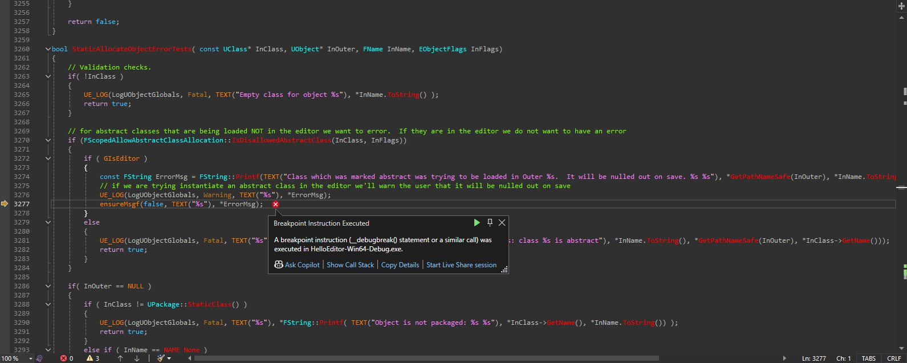

# Abstract

- **Function Description:** This class is designated as an abstract base class. It can be inherited but not instantiated.
- **Engine Module:** Blueprint
- **Metadata Type:** bool
- **Functionality Mechanism:** Add [CLASS_Abstract](../../../../Flags/EClassFlags/CLASS_Abstract.md) to ClassFlags
- **Common Usage:** ★★★★★

Designates this class as an abstract base class. It can be inherited but not instantiated.

Usually applied in base classes such as XXXBase.

## Sample Code:

```cpp
/*
	ClassFlags:	CLASS_Abstract | CLASS_MatchedSerializers | CLASS_Native | CLASS_RequiredAPI | CLASS_TokenStreamAssembled | CLASS_Intrinsic | CLASS_Constructed
*/
UCLASS(Blueprintable, abstract)
class INSIDER_API UMyClass_Abstract :public UObject
{
	GENERATED_BODY()
};

//Test Statement:
UMyClass_Abstract* obj=NewObject<UMyClass_Abstract>();
```

## Example Effect:

In the blueprint's ConstructObject, this class will not appear. Simultaneously, using NewObject in C++ will result in an error.



## Principle:

During the execution of NewObject, an abstract check is performed.

```cpp
bool StaticAllocateObjectErrorTests( const UClass* InClass, UObject* InOuter, FName InName, EObjectFlags InFlags)
{
	// Validation checks.
	if( !InClass )
	{
		UE_LOG(LogUObjectGlobals, Fatal, TEXT("Empty class for object %s"), *InName.ToString() );
		return true;
	}

	// for abstract classes that are being loaded NOT in the editor we want to error.  If they are in the editor we do not want to have an error
	if (FScopedAllowAbstractClassAllocation::IsDisallowedAbstractClass(InClass, InFlags))
	{
		if ( GIsEditor )
		{
			const FString ErrorMsg = FString::Printf(TEXT("Class which was marked abstract was trying to be loaded in Outer %s.  It will be nulled out on save. %s %s"), *GetPathNameSafe(InOuter), *InName.ToString(), *InClass->GetName());
			// if we are trying instantiate an abstract class in the editor we'll warn the user that it will be nulled out on save
			UE_LOG(LogUObjectGlobals, Warning, TEXT("%s"), *ErrorMsg);
			ensureMsgf(false, TEXT("%s"), *ErrorMsg);
		}
		else
		{
			UE_LOG(LogUObjectGlobals, Fatal, TEXT("%s"), *FString::Printf( TEXT("Can't create object %s in Outer %s: class %s is abstract"), *InName.ToString(), *GetPathNameSafe(InOuter), *InClass->GetName()));
			return true;
		}
	}
	}

	bool FScopedAllowAbstractClassAllocation::IsDisallowedAbstractClass(const UClass* InClass, EObjectFlags InFlags)
{
	if (((InFlags& RF_ClassDefaultObject) == 0) && InClass->HasAnyClassFlags(CLASS_Abstract))
	{
		if (AllowAbstractCount == 0)
		{
			return true;
		}
	}

	return false;
}
```