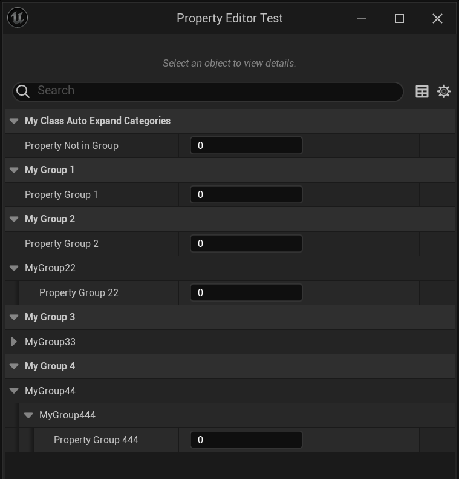

# AutoExpandCategories

- **Function description:** Specify the Category that objects of this class should automatically expand in the details panel.
- **Engine module:** Category
- **Metadata type:** strings = (abc, "d|e", "x|y|z")
- **Mechanism of action:** In Meta, remove [AutoCollapseCategories](../../../../Meta/DetailsPanel/AutoCollapseCategories.md) and add [AutoExpandCategories](../../../../Meta/DetailsPanel/AutoExpandCategories.md)
- **Associated items:** [AutoCollapseCategories](../AutoCollapseCategories/AutoCollapseCategories.md)
- **Commonly used:** ★

Specify the Category that objects of this class should automatically expand in the details panel.

- Categories can be filled in multiple times, corresponding to the Categories defined for the properties within this class.
- It is worth noting that the editor automatically saves the expanded and closed state of the property directory. It will also be affected by the configuration of DetailPropertyExpansion After opening the window, SDetailsViewBase::UpdateFilteredDetails () will save the currently expanded attribute items, which should be automatically expanded the next time it is opened. The saved code is GConfig->SetSingleLineArray ( TEXT ( "DetailPropertyExpansion" ), *Struct->GetName (), ExpandedPropertyItems , GEditorPerProjectIni ) ; thus saving under \ Hello \ Saved \ Config \ WindowsEditor \ EditorPerProjectUserSettings.ini . Therefore, in order to better test the status of this metadata. You should manually clear the saved values in ini before testing.

```cpp
[DetailCategories]
MyClass_AutoExpandCategories.MyClass_AutoExpandCategories=False
MyClass_AutoExpandCategories.MyGroup1=False
MyClass_AutoExpandCategories.MyGroup2=False
MyClass_AutoExpandCategories.MyGroup3=True
MyClass_AutoExpandCategories.MyGroup4=True

[DetailPropertyExpansion]
GeometryCache="\"Object.GeometryCache.Materials\" \"Object.GeometryCache.Tracks\" "
Object="\"Object.MyGroup2.MyGroup2|MyGroup22\" \"Object.MyGroup4.MyGroup4|MyGroup44\" \"Object.MyGroup4.MyGroup4|MyGroup44.MyGroup4|MyGroup44|MyGroup444\" "
GeometryCacheCodecV1="\"Object.GeometryCache.TopologyRanges\" "
GeometryCacheCodecBase="\"Object.GeometryCache.TopologyRanges\" "
MassSettings="\"Object.Mass\" "
DeveloperSettings=
SmartObjectSettings="\"Object.SmartObject\" "
MyClass_ShowCategories=
MyClass_ShowCategoriesChild=
MyClass_DontCollapseCategories="\"Object.MyGroup2.MyGroup2|MyGroup22\" \"Object.MyGroup3.MyGroup3|MyGroup33\" \"Object.MyGroup3.MyGroup3|MyGroup33.MyGroup3|MyGroup33|MyGroup333\" "
MyClass_CollapseCategories="\"Object.MyGroup2.MyGroup2|MyGroup22\" \"Object.MyGroup3.MyGroup3|MyGroup33\" \"Object.MyGroup3.MyGroup3|MyGroup33.MyGroup3|MyGroup33|MyGroup333\" "
MyClass_AutoExpandCategories="\"Object.MyGroup2.MyGroup2|MyGroup22\" \"Object.MyGroup4.MyGroup4|MyGroup44\" \"Object.MyGroup4.MyGroup4|MyGroup44.MyGroup4|MyGroup44|MyGroup444\" "
MyClass_AutoExpandCategoriesCompare=
MyClass_AutoCollapseCategories="\"Object.MyGroup2.MyGroup2|MyGroup22\" \"Object.MyGroup4.MyGroup4|MyGroup44\" \"Object.MyGroup4.MyGroup4|MyGroup44.MyGroup4|MyGroup44|MyGroup444\" "
```

According to the code search rules, the values of AutoExpandCategories and AutoCollapseCategories should be separated by spaces. The top-level directory is initially set to open by default, so AutoExpandCategories is generally used for subdirectories. There is also a restriction that requires opening level by level. Directly opening the deepest subdirectory is not sufficient. Therefore, in the sample code, the intermediate second-level directories "MyGroup4" and "MyGroup44" must also be specified|Ensure that "MyGroup44" is also included.

## Sample Code:

```cpp
UCLASS(Blueprintable, AutoExpandCategories = ("MyGroup2|MyGroup22", "MyGroup4|MyGroup44","MyGroup4|MyGroup44|MyGroup444"))
class INSIDER_API UMyClass_AutoExpandCategories :public UObject
{
	GENERATED_BODY()
public:
	UPROPERTY(EditAnywhere, BlueprintReadWrite)
		int Property_NotInGroup;
	UPROPERTY(EditAnywhere, BlueprintReadWrite, Category = "MyGroup1")
		int Property_Group1;
	UPROPERTY(EditAnywhere, BlueprintReadWrite, Category = "MyGroup2")
		int Property_Group2;
	UPROPERTY(EditAnywhere, BlueprintReadWrite, Category = "MyGroup2|MyGroup22")
		int Property_Group22;

	UPROPERTY(EditAnywhere, BlueprintReadWrite, Category = "MyGroup3|MyGroup33")
		int Property_Group33;
	UPROPERTY(EditAnywhere, BlueprintReadWrite, Category = "MyGroup4|MyGroup44|MyGroup444")
		int Property_Group444;
};

源码里最复杂的样例：
UCLASS(Config = Engine, PerObjectConfig, BlueprintType, AutoCollapseCategories = ("Data Layer|Advanced"), AutoExpandCategories = ("Data Layer|Editor", "Data Layer|Advanced|Runtime"))
class ENGINE_API UDataLayerInstance : public UObject

可以打开子目录：UCLASS(Blueprintable, AutoExpandCategories = ("MyGroup2|MyGroup22", "MyGroup4|MyGroup44","MyGroup4|MyGroup44|MyGroup444"))
不可以打开子目录：UCLASS(Blueprintable, AutoExpandCategories = ("MyGroup2|MyGroup22", "MyGroup4|MyGroup44|MyGroup444"))
```

## Example Effect:

After deleting the MyClass_AutoCollapseCategories value under DetailCategories and DetailPropertyExpansion in Saved\EditorPerProjectUserSettings, open the window using testprops class=MyClass_AutoExpandCategories:

By comparison, it can be seen that Expand indeed automatically expands subdirectories for immediate editing. The requirement is that the directories listed in AutoExpandCategories must match the Categories on the properties



## Principle:

UClass extracts the metadata of AutoExpandCategories and AutoCollapseCategories to determine whether a Category should be displayed.

```cpp
if (BaseClass->IsAutoExpandCategory(*CategoryName.ToString())		&&	!BaseClass->IsAutoCollapseCategory(*CategoryName.ToString()))
	{
		NewCategoryNode->SetNodeFlags(EPropertyNodeFlags::Expanded, true);
	}

bool UClass::IsAutoExpandCategory(const TCHAR* InCategory) const
{
	static const FName NAME_AutoExpandCategories(TEXT("AutoExpandCategories"));
	if (const FString* AutoExpandCategories = FindMetaData(NAME_AutoExpandCategories))
	{
		return !!FCString::StrfindDelim(**AutoExpandCategories, InCategory, TEXT(" "));
	}
	return false;
}

bool UClass::IsAutoCollapseCategory(const TCHAR* InCategory) const
{
	static const FName NAME_AutoCollapseCategories(TEXT("AutoCollapseCategories"));
	if (const FString* AutoCollapseCategories = FindMetaData(NAME_AutoCollapseCategories))
	{
		return !!FCString::StrfindDelim(**AutoCollapseCategories, InCategory, TEXT(" "));
	}
	return false;
}

```