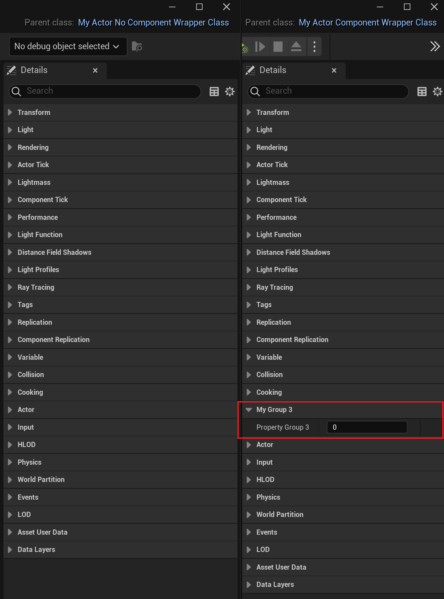

# ComponentWrapperClass

- **Function Description:** Designate this class as a simple wrapper class, disregarding Category-related configurations in its subclasses.
- **Engine Module:** Category
- **Metadata Type:** bool
- **Functionality Mechanism:** Add [IgnoreCategoryKeywordsInSubclasses](../../../../Meta/DetailsPanel/IgnoreCategoryKeywordsInSubclasses.md) in the Meta section
- **Commonality:** ★★

Designate this class as a simple wrapper class, disregarding the Category-related settings of its subclasses.

As suggested by the name, it serves as a wrapper for a component, essentially an Actor that contains just one Component. This simple wrapping relationship is exemplified by ALight wrapping ULightComponent and ASkeletalMeshActor wrapping USkeletalMeshComponent.

Control over the hideCategories and showCategories defined in subclasses is bypassed, and the directory definitions from the base class are directly adopted, which corresponds to the directory settings on this component's wrapper class. Currently, only BlueprintEditorUtils.cpp in the source code utilizes this, which is part of the blueprint opening process. Therefore, this setting only takes effect when a blueprint is opened by double-clicking. For standard UObject classes, windows created using testprops will not be affected since they are not opened by double-clicking a blueprint.

Searching the source code for ComponentWrapperClass reveals that it is only used by some Actors.

## Sample Code:

```cpp
UCLASS(Blueprintable, BlueprintType, ComponentWrapperClass, hideCategories = MyGroup3)	//Property_Group3 will still be displayed
class AMyActor_ComponentWrapperClass : public AActor
{
	GENERATED_UCLASS_BODY()
public:
	UPROPERTY(BlueprintReadOnly, VisibleAnywhere)
		class UPointLightComponent* PointLightComponent;

	UPROPERTY(EditAnywhere, BlueprintReadWrite, Category = MyGroup3)
		int Property_Group3;
};

UCLASS(Blueprintable, BlueprintType, hideCategories = MyGroup3)
class AMyActor_NoComponentWrapperClass : public AActor //Property_Group3 will be hidden
{
	GENERATED_UCLASS_BODY()
public:
	UPROPERTY(BlueprintReadOnly, VisibleAnywhere)
		class UPointLightComponent* PointLightComponent;

	UPROPERTY(EditAnywhere, BlueprintReadWrite, Category = MyGroup3)
		int Property_Group3;
};
```

## The Actual Functionality of the Subclass:

Even if MyGroup3 in the subclass is hidden, it will still be displayed.



## Principles:

ComponentWrapperClass effectively adds the metadata IgnoreCategoryKeywordsInSubclasses=true. Consequently, once the IgnoreCategoryKeywordsInSubclasses metadata is present, subsequent settings such as ShowCategories are not evaluated.

Currently, only BlueprintEditorUtils.cpp in the source code is using this, which is part of the blueprint opening process. Thus, this setting only takes effect when a blueprint is opened by double-clicking. For standard UObject classes, windows created directly using testprops will not be affected since they are not opened by double-clicking a blueprint.

```cpp
case EClassMetadataSpecifier::ComponentWrapperClass:
	MetaData.Add(NAME_IgnoreCategoryKeywordsInSubclasses, TEXT("true"));    //"IgnoreCategoryKeywordsInSubclasses"
	break;
////////////////////////////////////////////////////////////////////////////////
E:\P4V\Engine\Source\Editor\UnrealEd\Private\Kismet2\BlueprintEditorUtils.cpp
void FBlueprintEditorUtils::RecreateClassMetaData(UBlueprint* Blueprint, UClass* Class, bool bRemoveExistingMetaData)

if (!ParentClass->HasMetaData(FBlueprintMetadata::MD_IgnoreCategoryKeywordsInSubclasses)) //Should this setting be omitted:
		{
			// we want the categories just as they appear in the parent class
			// (set bHomogenize to false) - especially since homogenization
			// could inject spaces

			//With the absence of this setting, the subclass will inherit the directory settings from the parent class.
			FEditorCategoryUtils::GetClassHideCategories(ParentClass, AllHideCategories, /*bHomogenize =*/false);
			if (ParentClass->HasMetaData(TEXT("ShowCategories")))
			{
				Class->SetMetaData(TEXT("ShowCategories"), *ParentClass->GetMetaData("ShowCategories"));
			}
			if (ParentClass->HasMetaData(TEXT("AutoExpandCategories")))
			{
				Class->SetMetaData(TEXT("AutoExpandCategories"), *ParentClass->GetMetaData("AutoExpandCategories"));
			}
			if (ParentClass->HasMetaData(TEXT("AutoCollapseCategories")))
			{
				Class->SetMetaData(TEXT("AutoCollapseCategories"), *ParentClass->GetMetaData("AutoCollapseCategories"));
			}
			if (ParentClass->HasMetaData(TEXT("PrioritizeCategories")))
			{
				Class->SetMetaData(TEXT("PrioritizeCategories"), *ParentClass->GetMetaData("PrioritizeCategories"));
			}
		}
```