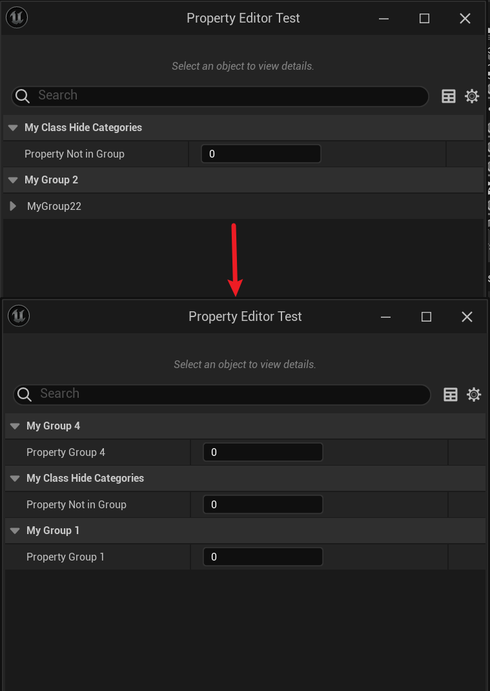

# HideCategories

- **Function description:** Hide certain properties under the Category in the ClassDefaults property panel of a class.
- **Engine module:** Category
- **Metadata type:** strings = (abc, "d"||y|z")
- **Related items:** [ShowCategories](../ShowCategories/ShowCategories.md)
- **Commonly used:** ★★★★

Hide certain Category properties in the ClassDefaults property panel of the class.

Note that you should first define the attribute in the class and then assign it to a Category. The information of HideCategories will be analyzed by UHT and stored in the metadata of UClass. The HideCategories information can be inherited by subclasses.

## Sample code:

```cpp
UCLASS(Blueprintable, hideCategories = MyGroup1)
class INSIDER_API UMyClass_HideCategories :public UObject
{
	GENERATED_BODY()
public:
	UPROPERTY(EditAnywhere, BlueprintReadWrite, Category = MyGroup1)
		int Property_Group1;
	UPROPERTY(EditAnywhere, BlueprintReadWrite, Category = "MyGroup2 | MyGroup3")
		int Property_Group23;

	UPROPERTY(EditAnywhere, BlueprintReadWrite)
		int Property_NotInGroup;
};

/*
(BlueprintType = true, HideCategories = MyGroup2 | MyGroup3, IncludePath = Class/Display/MyClass_ShowCategories.h, IsBlueprintBase = true, ModuleRelativePath = Class/Display/MyClass_ShowCategories.h)
*/

UCLASS(Blueprintable, showCategories = MyGroup1, hideCategories = "MyGroup2 | MyGroup3")
class INSIDER_API UMyClass_HideCategoriesChild :public UMyClass_ShowCategories
{
	GENERATED_BODY()
public:

	UPROPERTY(EditAnywhere, BlueprintReadWrite, Category = "MyGroup2")
		int Property_Group2;

	UPROPERTY(EditAnywhere, BlueprintReadWrite, Category = "MyGroup3")
		int Property_Group3;

	UPROPERTY(EditAnywhere, BlueprintReadWrite, Category = MyGroup4)
		int Property_Group4;
};

```

## Example effect:

Note here that MyGroup2 and MyGroup3 are also not displayed individually. Therefore, the criterion is simply that the directory matches a specific category name.



## Principle:

Check the ClassHideCategoriesMetaKey metadata in GetClassHideCategories.

```cpp
void  FEditorCategoryUtils::GetClassShowCategories(const UStruct* Class, TArray<FString>& CategoriesOut)
{
	CategoriesOut.Empty();

	using namespace FEditorCategoryUtilsImpl;
	if (Class->HasMetaData(ClassShowCategoriesMetaKey))
	{
		const FString& ShowCategories = Class->GetMetaData(ClassShowCategoriesMetaKey);
		ShowCategories.ParseIntoArray(CategoriesOut, TEXT(" "), /*InCullEmpty =*/true);

		for (FString& Category : CategoriesOut)
		{
			Category = GetCategoryDisplayString(FText::FromString(Category)).ToString();
		}
	}
}

void FEditorCategoryUtils::GetClassHideCategories(const UStruct* Class, TArray<FString>& CategoriesOut, bool bHomogenize)
{
	CategoriesOut.Empty();

	using namespace FEditorCategoryUtilsImpl;
	if (Class->HasMetaData(ClassHideCategoriesMetaKey))
	{
		const FString& HideCategories = Class->GetMetaData(ClassHideCategoriesMetaKey);

		HideCategories.ParseIntoArray(CategoriesOut, TEXT(" "), /*InCullEmpty =*/true);

		if (bHomogenize)
		{
			for (FString& Category : CategoriesOut)
			{
				Category = GetCategoryDisplayString(Category);
			}
		}
	}
}
```