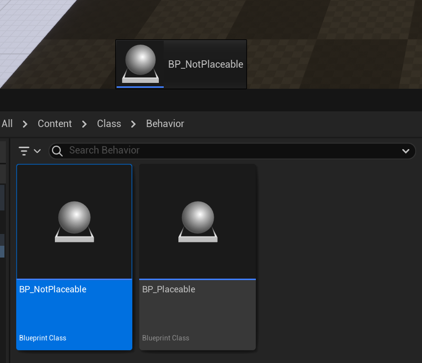

# NotPlaceable

- **Function description:** Indicates that this Actor cannot be placed within a level
- **Engine module:** Behavior
- **Metadata type:** bool
- **Action mechanism:** Adds [CLASS_NotPlaceable](../../../../Flags/EClassFlags/CLASS_NotPlaceable.md) to ClassFlags
- **Associated items:** Placeable (Placeable.md)
- **Commonality:** ★★★

Indicates that this Actor cannot be placed in a level and cannot be dragged into the scene. It invalidates the Placeable specifier inherited from the base class. It will be marked with CLASS_NotPlaceable in ClassFlags, a mark that is inheritable, meaning all its subclasses are also not placeable by default. For instance, AWorldSettings is an Actor that is not placeable.

However, note that this class can still be dynamically spawned into the level using SpawnActor.

Classes marked as NotPlaceable do not appear in the class selection for PlaceMode.

## Sample Code:

```cpp
UCLASS(Blueprintable,BlueprintType, NotPlaceable)
class INSIDER_API AMyActor_NotPlaceable :public AActor
{
	GENERATED_BODY()
};
```

## Example Effect:

When dragged into the scene, it will be impossible to create the Actor.



## Fundamental Principle:

If it is a direct C++ class, such as AMyActor_NotPlaceable, it can be directly dragged from the ContentBrowser into the scene. The source code reveals that only subclasses that inherit from Blueprints are subject to this restriction.

```cpp
TArray<AActor*> FLevelEditorViewportClient::TryPlacingActorFromObject( ULevel* InLevel, UObject* ObjToUse, bool bSelectActors, EObjectFlags ObjectFlags, UActorFactory* FactoryToUse, const FName Name, const FViewportCursorLocation* Cursor )
{

	bool bPlace = true;
	if (ObjectClass->IsChildOf(UBlueprint::StaticClass()))
	{
		UBlueprint* BlueprintObj = StaticCast<UBlueprint*>(ObjToUse);
		bPlace = BlueprintObj->GeneratedClass != NULL;
		if(bPlace)
		{
			check(BlueprintObj->ParentClass == BlueprintObj->GeneratedClass->GetSuperClass());
			if (BlueprintObj->GeneratedClass->HasAnyClassFlags(CLASS_NotPlaceable | CLASS_Abstract))
			{
				bPlace = false;
			}
		}
	}

	if (bPlace)
	{
		PlacedActor = FActorFactoryAssetProxy::AddActorForAsset( ObjToUse, bSelectActors, ObjectFlags, FactoryToUse, Name );
		if ( PlacedActor != NULL )
		{
			PlacedActors.Add(PlacedActor);
			PlacedActor->PostEditMove(true);
		}
	}
}
```