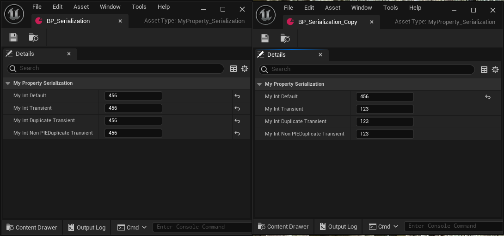

# NonPIEDuplicateTransient

- **Function description:** Ignore this property during object duplication, and in scenarios other than PIE.

- **Metadata type:** bool
- **Engine module:** Serialization
- **Mechanism of action:** Include [CPF_NonPIEDuplicateTransient](../../../../Flags/EPropertyFlags/CPF_NonPIEDuplicateTransient.md) in PropertyFlags
- **Commonly used:** ★

Ignore this property during object duplication, and in scenarios other than PIE.

- The difference between DuplicateTransient and NonPIEDuplicateTransient is that the former ignores this property during any object duplication, while the latter still duplicates the property during PIE (also during the object duplication process), with behavior consistent with the former in other duplication scenarios.
- PIE essentially involves copying the Actor from the current editing world to the PIE world, which triggers the duplication of the Actor.

## Sample Code:

Prepared a DataAsset and an Actor to separately verify the different duplication behaviors.

```cpp
UCLASS(Blueprintable, BlueprintType)
class INSIDER_API UMyProperty_Serialization :public UDataAsset
{
public:
	GENERATED_BODY()
public:
	UPROPERTY(EditAnywhere, BlueprintReadWrite)
		int32 MyInt_Default = 123;
		//PropertyFlags:	CPF_Edit | CPF_BlueprintVisible | CPF_ZeroConstructor | CPF_Transient | CPF_IsPlainOldData | CPF_NoDestructor | CPF_HasGetValueTypeHash | CPF_NativeAccessSpecifierPublic
	UPROPERTY(EditAnywhere, BlueprintReadWrite, Transient)
		int32 MyInt_Transient = 123;
		//PropertyFlags:	CPF_Edit | CPF_BlueprintVisible | CPF_ZeroConstructor | CPF_DuplicateTransient | CPF_IsPlainOldData | CPF_NoDestructor | CPF_HasGetValueTypeHash | CPF_NativeAccessSpecifierPublic
	UPROPERTY(EditAnywhere, BlueprintReadWrite, DuplicateTransient)
		int32 MyInt_DuplicateTransient = 123;
		//PropertyFlags:	CPF_Edit | CPF_BlueprintVisible | CPF_ZeroConstructor | CPF_IsPlainOldData | CPF_NoDestructor | CPF_NonPIEDuplicateTransient | CPF_HasGetValueTypeHash | CPF_NativeAccessSpecifierPublic
	UPROPERTY(EditAnywhere, BlueprintReadWrite, NonPIEDuplicateTransient)
		int32 MyInt_NonPIEDuplicateTransient = 123;
};

UCLASS(Blueprintable, BlueprintType)
class INSIDER_API AMyProperty_Serialization_TestActor :public AActor
{
public:
	GENERATED_BODY()
protected:
	UPROPERTY(EditAnywhere, BlueprintReadWrite)
		int32 MyInt_Default = 123;
		//PropertyFlags:	CPF_Edit | CPF_BlueprintVisible | CPF_ZeroConstructor | CPF_Transient | CPF_IsPlainOldData | CPF_NoDestructor | CPF_HasGetValueTypeHash | CPF_NativeAccessSpecifierPublic
	UPROPERTY(EditAnywhere, BlueprintReadWrite, Transient)
		int32 MyInt_Transient = 123;
		//PropertyFlags:	CPF_Edit | CPF_BlueprintVisible | CPF_ZeroConstructor | CPF_DuplicateTransient | CPF_IsPlainOldData | CPF_NoDestructor | CPF_HasGetValueTypeHash | CPF_NativeAccessSpecifierPublic
	UPROPERTY(EditAnywhere, BlueprintReadWrite, DuplicateTransient)
		int32 MyInt_DuplicateTransient = 123;
	UPROPERTY(EditAnywhere, BlueprintReadWrite, NonPIEDuplicateTransient)
		int32 MyInt_NonPIEDuplicateTransient = 123;
};
```

## Example Effect:

When duplicating an asset, DuplicateAsset and DuplicateObject occur, at which point PortFlags = PPF_Duplicate, and ShouldSerializeValue is triggered for judgment. This property is skipped at this time.

It can be observed that NonPIEDuplicateTransient is not duplicated.



When PIE is activated, it can be seen that NonPIEDuplicateTransient is indeed copied at this point. This is because PortFlags = PPF_DuplicateForPIE & PPF_Duplicate


In conclusion, this is used for certain cache data where serialization is not required during duplication, preventing two different Actors from using the same calculated temporary data. However, during PIE, Actors can each use their own set of data, because during PIE, the essence is copying an instance of the Actor from the current editing world to the PIE world, which triggers the duplication of the Actor.

## Principle:

During text export, this property is not serialized when not duplicating in PIE.

```cpp
bool FProperty::ShouldPort( uint32 PortFlags/*=0*/ ) const
{
// if we're not copying for PIE and NonPIETransient is set, don't export
	if (!(PortFlags & PPF_DuplicateForPIE) && HasAnyPropertyFlags(CPF_NonPIEDuplicateTransient))
	{
		return false;
	}
}
```

During binary serialization:

This property is skipped only when PPF_Duplicate is effective (DuplicateObject? or asset duplication), but serialization must continue during PIE.

```cpp
bool FProperty::ShouldSerializeValue(FArchive& Ar) const
{
// Skip properties marked NonPIEDuplicateTransient when duplicating, but not when we're duplicating for PIE
	if ((PropertyFlags & CPF_NonPIEDuplicateTransient) && !(Ar.GetPortFlags() & PPF_DuplicateForPIE) && (Ar.GetPortFlags() & PPF_Duplicate))
	{
		return false;
	}
}
```