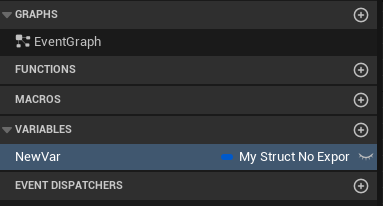

# NoExport

- **Function Description:** Instruct UHT not to automatically generate registration code, but to perform lexical analysis and extract metadata only.
- **Metadata Type:** bool
- **Engine Module:** UHT
- **Commonly Used: ★**

Instructions for UHT not to automatically generate registration code, but to perform lexical analysis and extract metadata only.

NoExportTypes.h frequently uses this example. Structures defined are often enclosed with the !CPP macro to prevent compilation in C++, thus typically used only within the engine.

We can actually use it if desired, provided the memory layout in C++ remains consistent, allowing for additional self-defined structures. Use case: Defining a UHT header for UHT analysis and then defining the actual C++ elsewhere. A typical application is where multiple classes in C++ inherit from a template base class, such as FVector2MaterialInput, enabling the definition of a UHT type alias for each specialized subclass. Another purpose is to place all headers to be analyzed by UHT in a single file to accelerate analysis and generation, eliminating the need to analyze multiple files, as long as the UHT information and memory layout are correct.

```cpp
#if !CPP	// begin noexport class
USTRUCT(noexport, BlueprintType) //If "noexport" is not specified, an error will occur: Expected a GENERATED_BODY() at the start of the struct
struct FFloatRK4SpringInterpolator
{

	UPROPERTY(EditAnywhere, Category = "FloatRK4SpringInterpolator")
	float StiffnessConstant;

	/** 0 = Undamped, <1 = Underdamped, 1 = Critically damped, >1 = Over damped */
	UPROPERTY(EditAnywhere, Category = "FloatRK4SpringInterpolator")
	float DampeningRatio;

	bool bIsInitialized;
	bool bIsInMotion;
	float TimeRemaining;
	FRK4SpringConstants SpringConstants;

	float LastPosition;
	RK4Integrator::FRK4State<float> State;
};
#endif	// end noexport class

//Practical Applications:
template <typename T>
struct FRK4SpringInterpolator
{
protected:
	float StiffnessConstant;
	float DampeningRatio;

	bool bIsInitialized;
	bool bIsInMotion;
	float TimeRemaining;
	FRK4SpringConstants SpringConstants;

	T LastPosition;
	RK4Integrator::FRK4State<T> State;
}

struct FFloatRK4SpringInterpolator : FRK4SpringInterpolator<float>
struct FVectorRK4SpringInterpolator : FRK4SpringInterpolator<FVector>
```

Excluded Code Includes:

```cpp
USTRUCT(BlueprintType,noexport)
struct INSIDER_API FMyStruct_NoExport
{
	//Suppression: Explanation of code generated by GENERATED_BODY():
	//static class UScriptStruct* StaticStruct();

	UPROPERTY(BlueprintReadWrite, EditAnywhere)
	float Score;
};

//Suppression:
//template<> INSIDER_API UScriptStruct* StaticStruct<struct FMyStruct_NoExport>();
```

 No generation in .h files, thus not used in other modules

```cpp
template<> INSIDER_API UScriptStruct* StaticStruct<struct FMyStruct_NoExport>();
```

However, the Z_Construct_UScriptStruct_FMyStruct_NoExport call will still be generated in Module.init.gen.cpp, thus it will still be exposed in blueprints.

```cpp
#include "UObject/GeneratedCppIncludes.h"
PRAGMA_DISABLE_DEPRECATION_WARNINGS
void EmptyLinkFunctionForGeneratedCodeInsider_init() {}
	INSIDER_API UScriptStruct* Z_Construct_UScriptStruct_FMyStruct_NoExport();
	static FPackageRegistrationInfo Z_Registration_Info_UPackage__Script_Insider;
	FORCENOINLINE UPackage* Z_Construct_UPackage__Script_Insider()
	{
		if (!Z_Registration_Info_UPackage__Script_Insider.OuterSingleton)
		{
			static UObject* (*const SingletonFuncArray[])() = {
					(UObject* (*)())Z_Construct_UScriptStruct_FMyStruct_NoExport,//Injection of the call here
			};
			static const UECodeGen_Private::FPackageParams PackageParams = {
				"/Script/Insider",
				SingletonFuncArray,
				UE_ARRAY_COUNT(SingletonFuncArray),
				PKG_CompiledIn | 0x00000000,
				0x02A7B98C,
				0xFA17C3C4,
				METADATA_PARAMS(0, nullptr)
			};
			UECodeGen_Private::ConstructUPackage(Z_Registration_Info_UPackage__Script_Insider.OuterSingleton, PackageParams);
		}
		return Z_Registration_Info_UPackage__Script_Insider.OuterSingleton;
	}
	static FRegisterCompiledInInfo Z_CompiledInDeferPackage_UPackage__Script_Insider(Z_Construct_UPackage__Script_Insider, TEXT("/Script/Insider"), Z_Registration_Info_UPackage__Script_Insider, CONSTRUCT_RELOAD_VERSION_INFO(FPackageReloadVersionInfo, 0x02A7B98C, 0xFA17C3C4));
PRAGMA_ENABLE_DEPRECATION_WARNINGS
```

Effect in Blueprints: Still can be used as a variable.




The difference with adding "noexport" is the inability to use StaticStruct and the absence of TCppStructOps, preventing certain optimizations. Otherwise, it can still be used normally, similar to FVector.

Missing code can also be manually added to achieve the same functionality.

```cpp
USTRUCT(BlueprintType,noexport)
struct INSIDER_API FMyStruct_NoExport
{
	//GENERATED_BODY() //missing type specifier - int assumed, ..generated.h only defines a StaticStruct() function

	static class UScriptStruct* StaticStruct();	//Can be self-defined

	UPROPERTY(BlueprintReadWrite, EditAnywhere)
	float Score;

};

template<> INSIDER_API UScriptStruct* StaticStruct<struct FMyStruct_NoExport>();//Can be self-defined

//.cpp
//Link function declarations, which have already been implemented in other .cpp files, allowing for normal invocation
INSIDER_API UScriptStruct* Z_Construct_UScriptStruct_FMyStruct_NoExport();
UPackage* Z_Construct_UPackage__Script_Insider();

static FStructRegistrationInfo Z_Registration_Info_UScriptStruct_MyStruct_NoExport;

class UScriptStruct* FMyStruct_NoExport::StaticStruct()
{
	if (!Z_Registration_Info_UScriptStruct_MyStruct_NoExport.OuterSingleton)
	{
		Z_Registration_Info_UScriptStruct_MyStruct_NoExport.OuterSingleton = GetStaticStruct(Z_Construct_UScriptStruct_FMyStruct_NoExport, Z_Construct_UPackage__Script_Insider(), TEXT("MyStruct_NoExport"));
	}
	return Z_Registration_Info_UScriptStruct_MyStruct_NoExport.OuterSingleton;
}

template<> INSIDER_API UScriptStruct* StaticStruct<FMyStruct_NoExport>()
{
	return FMyStruct_NoExport::StaticStruct();
}
```