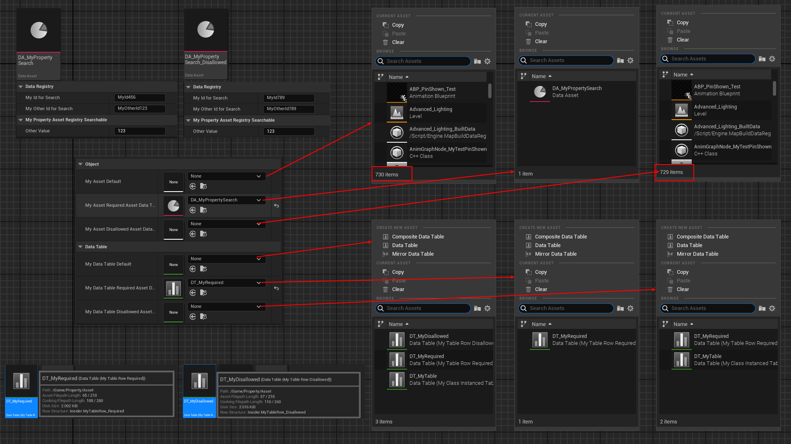

# RequiredAssetDataTags

- **功能描述：** 在UObject*属性上指定Tags来进行过滤，必须拥有该Tags才可以被选择。
- **使用位置：** UPROPERTY
- **引擎模块：** Asset Property
- **元数据类型：** strings="a=b，c=d，e=f"
- **限制类型：** UObject*
- **关联项：** [DisallowedAssetDataTags](../DisallowedAssetDataTags.md), [AssetRegistrySearchable](../../../Specifier/UPROPERTY/Asset/AssetRegistrySearchable/AssetRegistrySearchable.md)
- **常用程度：** ★★

在UObject*属性上指定Tags来进行过滤，必须拥有该Tags才可以被选择。

相关联的可参考AssetRegistrySearchable标识符和GetAssetRegistryTags 方法。

## 测试代码：

```cpp
USTRUCT(BlueprintType)
struct INSIDER_API FMyTableRow_Required :public FTableRowBase
{
	GENERATED_BODY()
public:
	UPROPERTY(BlueprintReadWrite, EditAnywhere)
	int32 MyInt = 123;
	UPROPERTY(BlueprintReadWrite, EditAnywhere)
	FString MyString;
};

USTRUCT(BlueprintType)
struct INSIDER_API FMyTableRow_Disallowed :public FTableRowBase
{
	GENERATED_BODY()
public:
	UPROPERTY(BlueprintReadWrite, EditAnywhere)
	float MyFloat = 123.f;
	UPROPERTY(BlueprintReadWrite, EditAnywhere)
	UTexture2D* MyTexture;
};

UCLASS(Blueprintable, BlueprintType)
class INSIDER_API UMyProperty_AssetDataTags :public UDataAsset
{
public:
	GENERATED_BODY()
public:
	UPROPERTY(EditAnywhere, BlueprintReadWrite, Category = Object)
	TObjectPtr<UObject> MyAsset_Default;

	UPROPERTY(EditAnywhere, BlueprintReadWrite, Category = Object, meta = (RequiredAssetDataTags = "MyIdForSearch=MyId456"))
	TObjectPtr<UObject> MyAsset_RequiredAssetDataTags;

	UPROPERTY(EditAnywhere, BlueprintReadWrite, Category = Object, meta = (DisallowedAssetDataTags = "MyOtherId=MyOtherId789"))
	TObjectPtr<UObject> MyAsset_DisallowedAssetDataTags;
public:
	UPROPERTY(EditAnywhere, Category = DataTable)
	TObjectPtr<class UDataTable> MyDataTable_Default;

	UPROPERTY(EditAnywhere, Category = DataTable, meta = (RequiredAssetDataTags = "RowStructure=/Script/Insider.MyTableRow_Required"))
	TObjectPtr<class UDataTable> MyDataTable_RequiredAssetDataTags;

	UPROPERTY(EditAnywhere, Category = DataTable, meta = (DisallowedAssetDataTags = "RowStructure=/Script/Insider.MyTableRow_Disallowed"))
	TObjectPtr<class UDataTable> MyDataTable_DisallowedAssetDataTags;
};
```

## 测试效果：

如上面代码所见，定义了两个不同类型的FTableRowBase，并且也创建了两个DataTable。同时也有两个DataAsset（AssetRegistrySearchable的例子里定义的结构）都有MyIdForSearch和MyOtherId的Tag，但是有不同的值，以此来进行区分。

- MyAsset_Default，可以筛选出所有的对象，图中示例有730个。
- MyAsset_RequiredAssetDataTags，因为加了RequiredAssetDataTags ，只有DA_MyPropertySearch符合，因为MyIdForSearch=MyId456。
- MyAsset_DisallowedAssetDataTags，把DA_MyPropertySearch_Disallowed过滤掉了，因为我配置的MyOtherId=MyOtherId789，因此只剩下729个。
- 关于DataTable也是同理。MyDataTable_Default可以获取所有的DataTable（有3个），而MyDataTable_RequiredAssetDataTags限制了RowStructure只能是FMyTableRow_Required （因此只能筛选出一个）。MyDataTable_DisallowedAssetDataTags排除掉一个RowStructure为FMyTableRow_Disallowed 的，因此就剩下2个。



## 源码中例子：

```cpp
	UPROPERTY(Category="StateTree", EditAnywhere, meta=(RequiredAssetDataTags="Schema=/Script/MassAIBehavior.MassStateTreeSchema"))
	TObjectPtr<UStateTree> StateTree;

	UPROPERTY(EditAnywhere, Category=Appearance, meta = (RequiredAssetDataTags = "RowStructure=/Script/UMG.RichImageRow"))
	TObjectPtr<class UDataTable> ImageSet;

	UPROPERTY(EditAnywhere, BlueprintReadWrite, Category=Compositing, meta = (AllowPrivateAccess, RequiredAssetDataTags = "IsSourceValid=True"), Setter = SetCompositeTexture, Getter = GetCompositeTexture)
	TObjectPtr<class UTexture> CompositeTexture;
```

## 原理:

在UObject*属性上RequiredAssetDataTags和DisallowedAssetDataTags的配置，会在这个属性的编辑器（SPropertyEditorAsset）初始化的时候解析提取到其成员变量RequiredAssetDataTags和DisallowedAssetDataTags里，本质就是个键值对。而后续在进行Asset过滤的时候（IsAssetFiltered的调用），就会开始把FAssetData里的Tags去匹配该属性的Tags需求。Disallowed的出现就排除掉，Required的必须拥有才不会被过滤，最终实现了过滤效果。

关于FAssetData里的Tags，可以参考AssetRegistrySearchable标识符和GetAssetRegistryTags 方法的调用和实现，简单来说就是在对象上会有个方式主动提供Tags给AssetRegistry。

关于DataTable为何可以通过RowStructure过滤，通过查看DataTable里的GetAssetRegistryTags方法就可以知道它主动提供了RowStructure的Tags注册。

```cpp
FAssetDataTagMapBase=TSortedMap<FName, FString, FDefaultAllocator, FNameFastLess>;

SPropertyEditorAsset::
	/** Tags (and eventually values) that can NOT be used with this property */
	TSharedPtr<FAssetDataTagMap> DisallowedAssetDataTags;

	**/** Tags and values that must be present for an asset to be used with this property */
	TSharedPtr<FAssetDataTagMap> RequiredAssetDataTags;

void SPropertyEditorAsset::InitializeAssetDataTags(const FProperty* Property)
{
	if (Property == nullptr)
{
	return;
}

const FProperty* MetadataProperty = GetActualMetadataProperty(Property);
const FString DisallowedAssetDataTagsFilterString = MetadataProperty->GetMetaData("DisallowedAssetDataTags");
if (!DisallowedAssetDataTagsFilterString.IsEmpty())
{
	TArray<FString> DisallowedAssetDataTagsAndValues;
	DisallowedAssetDataTagsFilterString.ParseIntoArray(DisallowedAssetDataTagsAndValues, TEXT(","), true);

	for (const FString& TagAndOptionalValueString : DisallowedAssetDataTagsAndValues)
	{
		TArray<FString> TagAndOptionalValue;
		TagAndOptionalValueString.ParseIntoArray(TagAndOptionalValue, TEXT("="), true);
		size_t NumStrings = TagAndOptionalValue.Num();
		check((NumStrings == 1) || (NumStrings == 2)); // there should be a single '=' within a tag/value pair

		if (!DisallowedAssetDataTags.IsValid())
		{
			DisallowedAssetDataTags = MakeShared<FAssetDataTagMap>();
		}
		DisallowedAssetDataTags->Add(FName(*TagAndOptionalValue[0]), (NumStrings > 1) ? TagAndOptionalValue[1] : FString());
	}
}

const FString RequiredAssetDataTagsFilterString = MetadataProperty->GetMetaData("RequiredAssetDataTags");
if (!RequiredAssetDataTagsFilterString.IsEmpty())
{
	TArray<FString> RequiredAssetDataTagsAndValues;
	RequiredAssetDataTagsFilterString.ParseIntoArray(RequiredAssetDataTagsAndValues, TEXT(","), true);

	for (const FString& TagAndOptionalValueString : RequiredAssetDataTagsAndValues)
	{
		TArray<FString> TagAndOptionalValue;
		TagAndOptionalValueString.ParseIntoArray(TagAndOptionalValue, TEXT("="), true);
		size_t NumStrings = TagAndOptionalValue.Num();
		check((NumStrings == 1) || (NumStrings == 2)); // there should be a single '=' within a tag/value pair

		if (!RequiredAssetDataTags.IsValid())
		{
			RequiredAssetDataTags = MakeShared<FAssetDataTagMap>();
		}
		RequiredAssetDataTags->Add(FName(*TagAndOptionalValue[0]), (NumStrings > 1) ? TagAndOptionalValue[1] : FString());
	}
}
}

bool SPropertyEditorAsset::IsAssetFiltered(const FAssetData& InAssetData)
{
//判断只要包含就不符合
	if (DisallowedAssetDataTags.IsValid())
	{
		for (const auto& DisallowedTagAndValue : *DisallowedAssetDataTags.Get())
		{
			if (InAssetData.TagsAndValues.ContainsKeyValue(DisallowedTagAndValue.Key, DisallowedTagAndValue.Value))
			{
				return true;
			}
		}
	}
	//判断必须包含才不会被过滤掉
	if (RequiredAssetDataTags.IsValid())
	{
		for (const auto& RequiredTagAndValue : *RequiredAssetDataTags.Get())
		{
			if (!InAssetData.TagsAndValues.ContainsKeyValue(RequiredTagAndValue.Key, RequiredTagAndValue.Value))
			{
				// For backwards compatibility compare against short name version of the tag value.
				if (!FPackageName::IsShortPackageName(RequiredTagAndValue.Value) &&
					InAssetData.TagsAndValues.ContainsKeyValue(RequiredTagAndValue.Key, FPackageName::ObjectPathToObjectName(RequiredTagAndValue.Value)))
				{
					continue;
				}
				return true;
			}
		}
	}
	return false;
}

void UDataTable::GetAssetRegistryTags(FAssetRegistryTagsContext Context) const
{
	if (AssetImportData)
	{
		Context.AddTag( FAssetRegistryTag(SourceFileTagName(), AssetImportData->GetSourceData().ToJson(), FAssetRegistryTag::TT_Hidden) );
	}

	// Add the row structure tag
	{
		static const FName RowStructureTag = "RowStructure";
		Context.AddTag( FAssetRegistryTag(RowStructureTag, GetRowStructPathName().ToString(), FAssetRegistryTag::TT_Alphabetical) );
	}

	Super::GetAssetRegistryTags(Context);
}

```