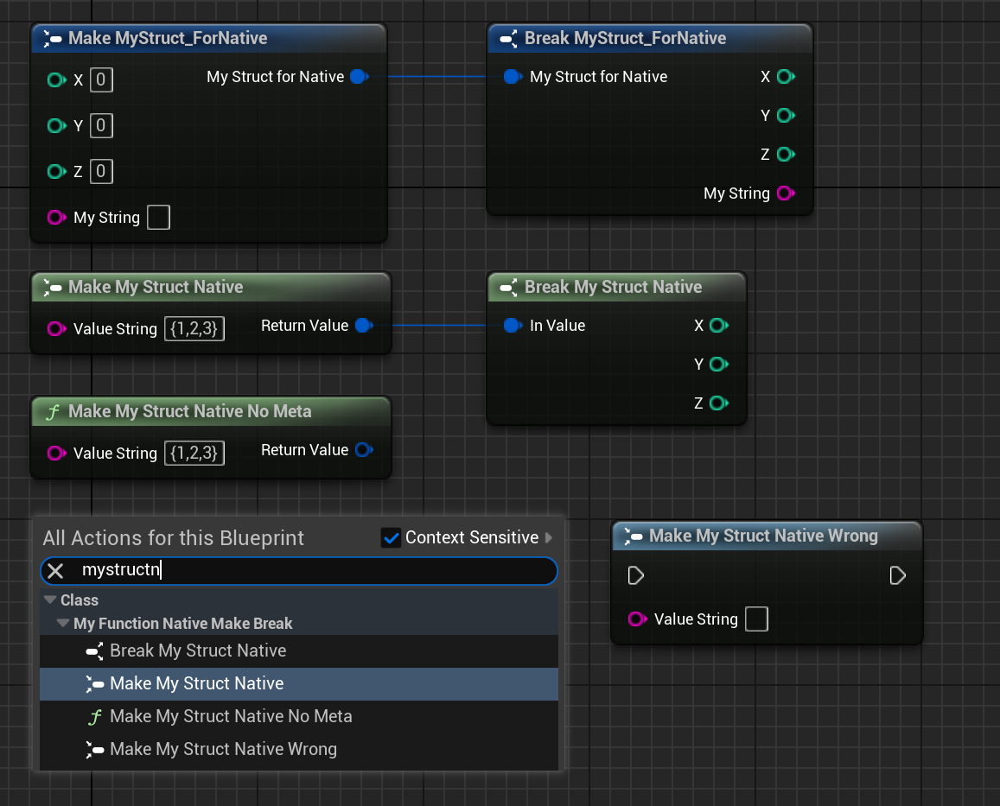

# NativeMakeFunc

- **功能描述：** 指定一个函数采用MakeStruct的图标
- **使用位置：** UFUNCTION
- **引擎模块：** Blueprint
- **元数据类型：** bool
- **关联项：** [NativeBreakFunc](../NativeBreakFunc.md)
- **常用程度：** ★

指定一个函数采用MakeStruct的图标。

这个函数的实际逻辑是否符合MakeStruct的规范并没有做检测，该标记只是造成显示图标的不同。因此虽然正常情况下都是搭配BlueprintPure，但是BlueprintCallable也无所谓。甚至MakeMyStructNative_Wrong函数的版本没有返回值也可以编译通过。

## 测试代码：

```cpp
USTRUCT(BlueprintType)
struct FMyStruct_ForNative
{
	GENERATED_BODY()
public:
	UPROPERTY(BlueprintReadWrite, EditAnywhere)
	int32 X = 0;
	UPROPERTY(BlueprintReadWrite, EditAnywhere)
	int32 Y = 0;
	UPROPERTY(BlueprintReadWrite, EditAnywhere)
	int32 Z = 0;
	UPROPERTY(BlueprintReadWrite, EditAnywhere)
	FString MyString;
};

UCLASS(Blueprintable, BlueprintType)
class INSIDER_API UMyFunction_NativeMakeBreak :public UBlueprintFunctionLibrary
{
public:
	GENERATED_BODY()
public:
	UFUNCTION(BlueprintPure, meta = (NativeMakeFunc))
	static FMyStruct_ForNative MakeMyStructNative(FString ValueString);

	UFUNCTION(BlueprintPure)
	static FMyStruct_ForNative MakeMyStructNative_NoMeta(FString ValueString);

	UFUNCTION(BlueprintPure, meta = (NativeBreakFunc))
	static void BreakMyStructNative(const FMyStruct_ForNative& InValue, int32& X, int32& Y, int32& Z);

	UFUNCTION(BlueprintCallable, meta = (NativeMakeFunc))
	static void MakeMyStructNative_Wrong(FString ValueString);
};
```

## 蓝图里效果：

可以看到如果是NoMeta，则函数的图标就是标准是f图标，否则则是另外的图标。同时也注意到Struct可以有多个Make和Break函数，都可以同时正常使用。



## 原理：

在引擎源码里唯一找到的地方是如下代码。因此该标记实际上并没有逻辑上的差别，但是在显示上会有差别。

可以看见针对NativeMakeFunc和NativeBrakeFunc采用了不同的图标。

```cpp
FSlateIcon UK2Node_CallFunction::GetPaletteIconForFunction(UFunction const* Function, FLinearColor& OutColor)
{
	static const FName NativeMakeFunc(TEXT("NativeMakeFunc"));
	static const FName NativeBrakeFunc(TEXT("NativeBreakFunc"));

	if (Function && Function->HasMetaData(NativeMakeFunc))
	{
		static FSlateIcon Icon(FAppStyle::GetAppStyleSetName(), "GraphEditor.MakeStruct_16x");
		return Icon;
	}
	else if (Function && Function->HasMetaData(NativeBrakeFunc))
	{
		static FSlateIcon Icon(FAppStyle::GetAppStyleSetName(), "GraphEditor.BreakStruct_16x");
		return Icon;
	}
	// Check to see if the function is calling an function that could be an event, display the event icon instead.
	else if (Function && UEdGraphSchema_K2::FunctionCanBePlacedAsEvent(Function))
	{
		static FSlateIcon Icon(FAppStyle::GetAppStyleSetName(), "GraphEditor.Event_16x");
		return Icon;
	}
	else
	{
		OutColor = GetPalletteIconColor(Function);

		static FSlateIcon Icon(FAppStyle::GetAppStyleSetName(), "Kismet.AllClasses.FunctionIcon");
		return Icon;
	}
}

```