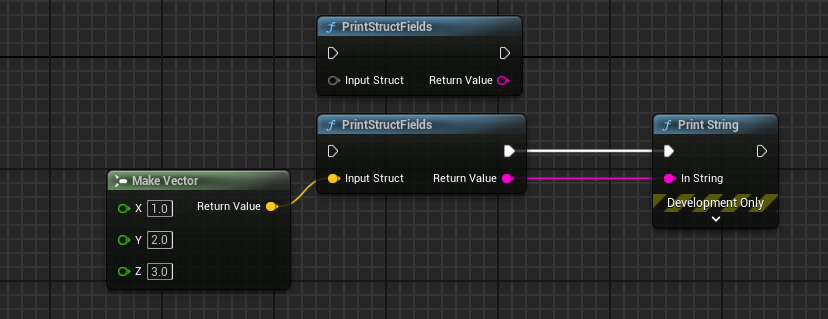

# CustomStructureParam

- **功能描述：** 被CustomStructureParam标记的函数参数会变成Wildcard的通配符参数，其引脚的类型会等于连接的变量类型。
- **使用位置：** UFUNCTION
- **引擎模块：** Blueprint
- **元数据类型：** strings="a，b，c"
- **常用程度：** ★★★★★

被CustomStructureParam标记的多个函数参数会变成Wildcard的通配符参数，其引脚的类型会等于连接的变量类型。

CustomStructureParam总是和CustomThunk一起配合使用，这样才能在自己的函数体内来处理泛型的参数类型。

```cpp
UFUNCTION(BlueprintCallable, CustomThunk, meta = (DisplayName = "PrintStructFields", CustomStructureParam = "inputStruct"))
static FString PrintStructFields(const int32& inputStruct) { return TEXT(""); }

DECLARE_FUNCTION(execPrintStructFields);
static FString Generic_PrintStructFields(const UScriptStruct* ScriptStruct, const void* StructData);

DEFINE_FUNCTION(UMyFunction_Custom::execPrintStructFields)
{
	FString result;
	Stack.MostRecentPropertyAddress = nullptr;
	Stack.StepCompiledIn<FStructProperty>(nullptr);

	void* StructData = Stack.MostRecentPropertyAddress;
	FStructProperty* StructProperty = CastField<FStructProperty>(Stack.MostRecentProperty);
	UScriptStruct* ScriptStruct = StructProperty->Struct;
	P_FINISH;
	P_NATIVE_BEGIN;

	result = Generic_PrintStructFields(ScriptStruct, StructData);

	P_NATIVE_END;
	*(FString*)RESULT_PARAM = result;
}

FString UMyFunction_Custom::Generic_PrintStructFields(const UScriptStruct* ScriptStruct, const void* StructData)
{
	FString str;
	for (TFieldIterator<FProperty> i(ScriptStruct); i; ++i)
	{
		FString propertyValueString;
		const void* propertyValuePtr = i->ContainerPtrToValuePtr<const void*>(StructData);
		i->ExportTextItem_Direct(propertyValueString, propertyValuePtr, nullptr, (UObject*)ScriptStruct, PPF_None);

		str += FString::Printf(TEXT("%s:%s\n"), *i->GetFName().ToString(), *propertyValueString);
	}

	return str;
}

```

## 蓝图中的效果：



可以看到定义了一个接受通用结构参数的节点，然后打印出内部所有的属性。其中CustomStructureParam 指定函数的参数是自定义的类型。

源码中的典型例子是

```cpp
UFUNCTION(BlueprintCallable, CustomThunk, Category = "DataTable", meta=(CustomStructureParam = "OutRow", BlueprintInternalUseOnly="true"))
static ENGINE_API bool GetDataTableRowFromName(UDataTable* Table, FName RowName, FTableRowBase& OutRow);
```

## 原理：

首先拥有CustomStructureParam的参数会被识别为Wildcard属性。然后通过FCustomStructureParamHelper来控制Pin->PinType = LinkedTo->PinType;，从而改变Pin的实际类型。

```cpp
bool UEdGraphSchema_K2::IsWildcardProperty(const FProperty* Property)
{
	UFunction* Function = Property->GetOwner<UFunction>();

	return Function && ( UK2Node_CallArrayFunction::IsWildcardProperty(Function, Property)
		|| UK2Node_CallFunction::IsStructureWildcardProperty(Function, Property->GetFName())
		|| UK2Node_CallFunction::IsWildcardProperty(Function, Property)
		|| FEdGraphUtilities::IsArrayDependentParam(Function, Property->GetFName()) );
}

static void FCustomStructureParamHelper::HandleSinglePin(UEdGraphPin* Pin)
{
	if (Pin)
	{
		if (Pin->LinkedTo.Num() > 0)
		{
			UEdGraphPin* LinkedTo = Pin->LinkedTo[0];
			check(LinkedTo);

			if (UK2Node* Node = Cast<UK2Node>(Pin->GetOwningNode()))
			{
				ensure(
					!LinkedTo->PinType.IsContainer() ||
					Node->DoesWildcardPinAcceptContainer(Pin)
				);
			}
			else
			{
				ensure( !LinkedTo->PinType.IsContainer() );
			}

			Pin->PinType = LinkedTo->PinType;
		}
		else
		{
			// constness and refness are controlled by our declaration
			// but everything else needs to be reset to default wildcard:
			const bool bWasRef = Pin->PinType.bIsReference;
			const bool bWasConst = Pin->PinType.bIsConst;

			Pin->PinType = FEdGraphPinType();
			Pin->PinType.bIsReference = bWasRef;
			Pin->PinType.bIsConst = bWasConst;
			Pin->PinType.PinCategory = UEdGraphSchema_K2::PC_Wildcard;
			Pin->PinType.PinSubCategory = NAME_None;
			Pin->PinType.PinSubCategoryObject = nullptr;
		}
	}
}
```