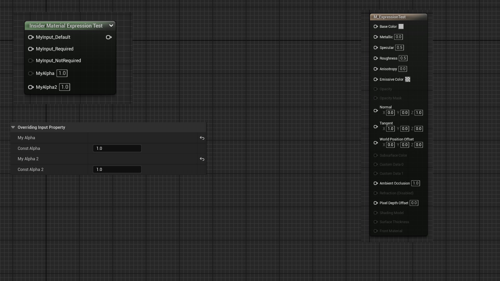

# OverridingInputProperty

- **功能描述：** 在UMaterialExpression中指定本float要覆盖的其他FExpressionInput 属性。
- **使用位置：** UPROPERTY
- **引擎模块：** Material
- **元数据类型：** bool
- **限制类型：** UMaterialExpression::float
- **关联项：** [RequiredInput](../RequiredInput.md)
- **常用程度：** ★★★

在UMaterialExpression中指定本float要覆盖的其他FExpressionInput 属性。

- 在材质表达式里有些属性，当用户没连接的时候，我们想提供一个默认值。这个时候这个Float属性的指就可以当作默认值。
- 而当用户连接的时候，这个引脚又要变成一个正常的输入，因此得有另一个FExpressionInput 属性，所以才需要用OverridingInputProperty 指定另一个属性。
- 被OverridingInputProperty 指定的FExpressionInput 属性一般是RequiredInput = "false"，因为正常的逻辑是你都提供默认值了，那当然用户就不一定非得输入这个值了。当然也可以RequiredInput = "true"，提醒用户这个引脚最好要有个输入，但如果真没有，也可以用默认值。
- 输出节点上的很多BaseColor之类的引脚就是又RequiredInput又提供默认值的。

## 测试代码：

在Compile函数中模仿源码给大家示范如何正确处理这种属性来获得值。大家也可以参照源码中别的例子来参考。

```cpp
UCLASS()
class UMyProperty_MyMaterialExpression : public UMaterialExpression
{
	GENERATED_UCLASS_BODY()
public:
	UPROPERTY()
	FExpressionInput MyInput_Default;

	UPROPERTY(meta = (RequiredInput = "true"))
	FExpressionInput MyInput_Required;

	UPROPERTY(meta = (RequiredInput = "false"))
	FExpressionInput MyInput_NotRequired;
public:
	UPROPERTY(EditAnywhere, Category = OverridingInputProperty, meta = (RequiredInput = "false"))
	FExpressionInput MyAlpha;

	/** only used if MyAlpha is not hooked up */
	UPROPERTY(EditAnywhere, Category = OverridingInputProperty, meta = (OverridingInputProperty = "MyAlpha"))
	float ConstAlpha = 1.f;

	UPROPERTY(EditAnywhere, Category = OverridingInputProperty, meta = (RequiredInput = "true"))
	FExpressionInput MyAlpha2;

	/** only used if MyAlpha is not hooked up */
	UPROPERTY(EditAnywhere, Category = OverridingInputProperty, meta = (OverridingInputProperty = "MyAlpha2"))
	float ConstAlpha2 = 1.f;
public:

	//~ Begin UMaterialExpression Interface
#if WITH_EDITOR
	virtual int32 Compile(class FMaterialCompiler* Compiler, int32 OutputIndex) override
	{
		int32 IndexAlpha = MyAlpha.GetTracedInput().Expression ? MyAlpha.Compile(Compiler) : Compiler->Constant(ConstAlpha);
		return 0;
	}
	virtual void GetCaption(TArray<FString>& OutCaptions) const override;

	virtual bool GenerateHLSLExpression(FMaterialHLSLGenerator& Generator, UE::HLSLTree::FScope& Scope, int32 OutputIndex, UE::HLSLTree::FExpression const*& OutExpression) const override;
#endif
	//~ End UMaterialExpression Interface
};

```

## 测试结果：

可见MyAlpha和MyAlpha2的右边都有个默认值，二者又因为RequiredInput的不同而一个灰色一个白色。

其他3个MyInput用来给大家对比。

右侧的材质最终输出表达式上的各个引脚更是有各种情况来让大家参考。



## 原理：

其实也是根据Meta的标记，来改变引脚的可编辑状态以及输入框。

```cpp

bool UMaterialExpression::CanEditChange(const FProperty* InProperty) const
{
	bool bIsEditable = Super::CanEditChange(InProperty);
	if (bIsEditable && InProperty != nullptr)
	{
		// Automatically set property as non-editable if it has OverridingInputProperty metadata
		// pointing to an FExpressionInput property which is hooked up as an input.
		//
		// e.g. in the below snippet, meta=(OverridingInputProperty = "A") indicates that ConstA will
		// be overridden by an FExpressionInput property named 'A' if one is connected, and will thereby
		// be set as non-editable.
		//
		//	UPROPERTY(meta = (RequiredInput = "false", ToolTip = "Defaults to 'ConstA' if not specified"))
		//	FExpressionInput A;
		//
		//	UPROPERTY(EditAnywhere, Category = MaterialExpressionAdd, meta = (OverridingInputProperty = "A"))
		//	float ConstA;
		//

		static FName OverridingInputPropertyMetaData(TEXT("OverridingInputProperty"));

		if (InProperty->HasMetaData(OverridingInputPropertyMetaData))
		{
			const FString& OverridingPropertyName = InProperty->GetMetaData(OverridingInputPropertyMetaData);

			FStructProperty* StructProp = FindFProperty<FStructProperty>(GetClass(), *OverridingPropertyName);
			if (ensure(StructProp != nullptr))
			{
				static FName RequiredInputMetaData(TEXT("RequiredInput"));

				// Must be a single FExpressionInput member, not an array, and must be tagged with metadata RequiredInput="false"
				if (ensure(	StructProp->Struct->GetFName() == NAME_ExpressionInput &&
							StructProp->ArrayDim == 1 &&
							StructProp->HasMetaData(RequiredInputMetaData) &&
							!StructProp->GetBoolMetaData(RequiredInputMetaData)))
				{
					const FExpressionInput* Input = StructProp->ContainerPtrToValuePtr<FExpressionInput>(this);

					if (Input->Expression != nullptr && Input->GetTracedInput().Expression != nullptr)
					{
						bIsEditable = false;
					}
				}
			}
		}

		if (bIsEditable)
		{
			// If the property has EditCondition metadata, then whether it's editable depends on the other EditCondition property
			const FString EditConditionPropertyName = InProperty->GetMetaData(TEXT("EditCondition"));
			if (!EditConditionPropertyName.IsEmpty())
			{
				FBoolProperty* EditConditionProperty = FindFProperty<FBoolProperty>(GetClass(), *EditConditionPropertyName);
				{
					bIsEditable = *EditConditionProperty->ContainerPtrToValuePtr<bool>(this);
				}
			}
		}
	}

	return bIsEditable;
}

```