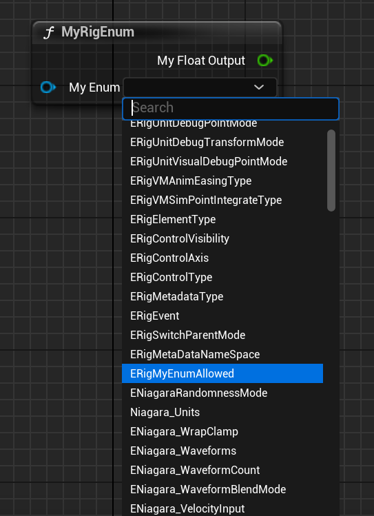

# RigVMTypeAllowed

- **功能描述：** 指定一个UENUM可以在FRigUnit的UEnum*属性中被选择。
- **使用位置：** UENUM
- **引擎模块：** RigVMStruct
- **元数据类型：** bool
- **常用程度：** ★★

指定一个UENUM可以在FRigUnit的UEnum*属性中被选择。

## 测试代码：

```cpp

UENUM(BlueprintType)
enum class ERigMyEnum : uint8
{
	First,
	Second,
	Third,
};

UENUM(BlueprintType, meta = (RigVMTypeAllowed))
enum class ERigMyEnumAllowed : uint8
{
	Cat,
	Dog,
	Tiger,
};

USTRUCT(meta = (DisplayName = "MyRigEnum"))
struct INSIDER_API FRigUnit_MyRigEnum : public FRigUnit
{
	GENERATED_BODY()

	RIGVM_METHOD()
		virtual void Execute() override;
public:
	UPROPERTY(meta = (Input))
	UEnum* MyEnum;

	UPROPERTY(meta = (Output))
	float MyFloat_Output = 123.f;
};
```

## 测试效果：

可见在选项列表中只有ERigMyEnumAllowed，没有ERigMyEnum。



## 原理：

在生成选项的时候，判断 !Enum->IsAsset()说明是C++里的枚举，然后必须有RigVMTypeAllowed。

```cpp
void SRigVMEnumPicker::PopulateEnumOptions()
{
	EnumOptions.Reset();
	EnumOptions.Add(MakeShareable(new FString(TEXT("None"))));
	for (TObjectIterator<UEnum> EnumIt; EnumIt; ++EnumIt)
	{
		UEnum* Enum = *EnumIt;

		if (Enum->HasAnyFlags(RF_BeginDestroyed | RF_FinishDestroyed) || !Enum->HasAllFlags(RF_Public))
		{
			continue;
		}

		// Any asset based enum is valid
		if (!Enum->IsAsset())
		{
			// Native enums only allowed if contain RigVMTypeAllowed metadata
			if (!Enum->HasMetaData(TEXT("RigVMTypeAllowed")))
			{
				continue;
			}
		}

		EnumOptions.Add(MakeShareable(new FString(Enum->GetPathName())));
	}
}
```