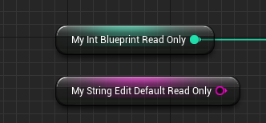

# SparseClassDataType

- **功能描述：** 让Actor的一些重复不变的数据存放在一个共同的结构里，以达到减少内容使用量的目的
- **引擎模块：** Blueprint
- **元数据类型：** string="abc"
- **作用机制：** 在Meta中增加[SparseClassDataTypes](../../../../Meta/Blueprint/SparseClassDataTypes.md)
- **关联项：** [NoGetter](../../../../Meta/SparseDataType/NoGetter/NoGetter.md)
- **常用程度：** ★★★

这是个重构和性能优化的点。在使用SparseClassDataType的时候，分为两种情况，一是以前的Actor想利用这个特性来优化，二是新创建的Actor一开始就想使用这个特性。

## 示例用法：

分为两部分：

一，旧的Actor存在冗余属性

简而言之是那些不会在BP改变的属性。C++方面，如果有修改这些属性，也要修改为使用Get函数来获得，从而转到SparseDataStruct里去。

```cpp
UCLASS(Blueprintable, BlueprintType)
class INSIDER_API AMyActor_SparseClassDataTypes :public AActor
{
	GENERATED_BODY()

public:
	UPROPERTY(EditDefaultsOnly)
		int32 MyInt_EditDefaultOnly = 123;

	UPROPERTY(BlueprintReadOnly)
		int32 MyInt_BlueprintReadOnly = 1024;

	UPROPERTY(EditDefaultsOnly, BlueprintReadOnly)
		FString MyString_EditDefault_ReadOnly = TEXT("MyName");

	UPROPERTY(EditAnywhere)
		float MyFloat_EditAnywhere = 555.f;

	UPROPERTY(BlueprintReadWrite)
		float MyFloat_BlueprintReadWrite = 666.f;
};
```

改为以下的代码。把属性用WITH_EDITORONLY_DATA包起来，以示意只在editor下做操作，在runtime是已经消除的。加上_DEPRECATED后缀标记也是为了进一步提醒原先BP里的访问要去除。重载MoveDataToSparseClassDataStruct以便把现在BP Class Defaults里配置的值拷贝给新的FMySparseClassData结构数值。

```cpp
USTRUCT(BlueprintType)
struct FMySparseClassData
{
    GENERATED_BODY()

    UPROPERTY(EditDefaultsOnly)
        int32 MyInt_EditDefaultOnly = 123;

    UPROPERTY(EditDefaultsOnly, BlueprintReadOnly)
        int32 MyInt_BlueprintReadOnly = 1024;

    // "GetByRef" means that Blueprint graphs access a const ref instead of a copy.
    UPROPERTY(EditDefaultsOnly, BlueprintReadOnly, meta=(GetByRef))
        FString MyString_EditDefault_ReadOnly = TEXT("MyName");
};

UCLASS(Blueprintable, BlueprintType,SparseClassDataTypes= MySparseClassData)
class INSIDER_API AMyActor_SparseClassDataTypes :public AActor
{
	GENERATED_BODY()

public:
#if WITH_EDITOR
	// ~ This function transfers existing data into FMySparseClassData.
	virtual void MoveDataToSparseClassDataStruct() const override;
#endif // WITH_EDITOR
public:
#if WITH_EDITORONLY_DATA
	UPROPERTY()
		int32 MyInt_EditDefaultOnly_DEPRECATED = 123;

	UPROPERTY()
		int32 MyInt_BlueprintReadOnly_DEPRECATED = 1024;

	UPROPERTY()
		FString MyString_EditDefault_ReadOnly_DEPRECATED = TEXT("MyName");
#endif // WITH_EDITORONLY_DATA
public:
	UPROPERTY(EditAnywhere)
		float MyFloat_EditAnywhere = 555.f;

	UPROPERTY(BlueprintReadWrite)
		float MyFloat_BlueprintReadWrite = 666.f;
};

//cpp
#if WITH_EDITOR
void AMyActor_SparseClassDataTypes::MoveDataToSparseClassDataStruct() const
{
	// make sure we don't overwrite the sparse data if it has been saved already
	UBlueprintGeneratedClass* BPClass = Cast<UBlueprintGeneratedClass>(GetClass());
	if (BPClass == nullptr || BPClass->bIsSparseClassDataSerializable == true)
	{
		return;
	}

	Super::MoveDataToSparseClassDataStruct();

#if WITH_EDITORONLY_DATA
	// Unreal Header Tool (UHT) will create GetMySparseClassData automatically.
	FMySparseClassData* SparseClassData = GetMySparseClassData();

	// Modify these lines to include all Sparse Class Data properties.
	SparseClassData->MyInt_EditDefaultOnly = MyInt_EditDefaultOnly_DEPRECATED;
	SparseClassData->MyInt_BlueprintReadOnly = MyInt_BlueprintReadOnly_DEPRECATED;
	SparseClassData->MyString_EditDefault_ReadOnly = MyString_EditDefault_ReadOnly_DEPRECATED;
#endif // WITH_EDITORONLY_DATA

}
#endif // WITH_EDITOR
```

在BP的PostLoad加载之后，会自动的调用MoveDataToSparseClassDataStruct，所以要在内部检测bIsSparseClassDataSerializable.

```cpp
void UBlueprintGeneratedClass::PostLoadDefaultObject(UObject* Object)
{
	FScopeLock SerializeAndPostLoadLock(&SerializeAndPostLoadCritical);

	Super::PostLoadDefaultObject(Object);

	if (Object == ClassDefaultObject)
	{
		// Rebuild the custom property list used in post-construct initialization logic. Note that PostLoad() may have altered some serialized properties.
		UpdateCustomPropertyListForPostConstruction();

		// Restore any property values from config file
		if (HasAnyClassFlags(CLASS_Config))
		{
			ClassDefaultObject->LoadConfig();
		}
	}

#if WITH_EDITOR
	Object->MoveDataToSparseClassDataStruct();

	if (Object->GetSparseClassDataStruct())
	{
		// now that any data has been moved into the sparse data structure we can safely serialize it
		bIsSparseClassDataSerializable = true;
	}

	ConformSparseClassData(Object);
#endif
}
```

在UClass下

```cpp
protected:
	/** This is where we store the data that is only changed per class instead of per instance */
	void* SparseClassData;

	/** The struct used to store sparse class data. */
	UScriptStruct* SparseClassDataStruct;

在构造UClass的时候，会SetSparseClassDataStruct来把结构传进去，因此就把结构关联起来。
UClass* Z_Construct_UClass_AMyActor_SparseClassDataTypes()
{
	if (!Z_Registration_Info_UClass_AMyActor_SparseClassDataTypes.OuterSingleton)
	{
		UECodeGen_Private::ConstructUClass(Z_Registration_Info_UClass_AMyActor_SparseClassDataTypes.OuterSingleton, Z_Construct_UClass_AMyActor_SparseClassDataTypes_Statics::ClassParams);
		Z_Registration_Info_UClass_AMyActor_SparseClassDataTypes.OuterSingleton->SetSparseClassDataStruct(AMyActor_SparseClassDataTypes::StaticGetMySparseClassDataScriptStruct());
	}
	return Z_Registration_Info_UClass_AMyActor_SparseClassDataTypes.OuterSingleton;
}
```

注意此时BP里没法blueprint get 那些ReadOnly的变量的，因为有_DEPRECATED在占用着。一种方法是自己再额外定义Gettter方法：

```cpp
UFUNCTION(BlueprintPure)
int32 GetMyMyInt_BlueprintReadOnly()const
{
	return GetMySparseClassData()->MyInt_BlueprintReadOnly;
}
```

二，另一种方法是在MoveDataToSparseClassDataStruct之后（记得要打开编辑器，并且打开子类BP蓝图后保存）就干脆删除掉AMyActor_SparseClassDataTypes里的冗余属性，全部使用FMySparseClassData中的值。从而变成：

```cpp
USTRUCT(BlueprintType)
struct FMySparseClassData
{
    GENERATED_BODY()

    UPROPERTY(EditDefaultsOnly)
        int32 MyInt_EditDefaultOnly = 123;

    UPROPERTY(EditDefaultsOnly, BlueprintReadOnly)
        int32 MyInt_BlueprintReadOnly = 1024;

    // "GetByRef" means that Blueprint graphs access a const ref instead of a copy.
    UPROPERTY(EditDefaultsOnly, BlueprintReadOnly, meta=(GetByRef))
        FString MyString_EditDefault_ReadOnly = TEXT("MyName");
};

UCLASS(Blueprintable, BlueprintType,SparseClassDataTypes= MySparseClassData)
class INSIDER_API AMyActor_SparseClassDataTypes :public AActor
{
	GENERATED_BODY()

public:
	UPROPERTY(EditAnywhere)
		float MyFloat_EditAnywhere = 555.f;

	UPROPERTY(BlueprintReadWrite)
		float MyFloat_BlueprintReadWrite = 666.f;
};
```

这样就达到了最终的效果，这个效果也对新的Actor要采用冗余属性的结果也是一样的。注意此时，在BP里是依然可以访问BlueprintReadOnly属性的，因为UHT和BP系统已经帮我们加了一层访问方便的控制。

## 示例效果：

UHT会帮我们生成C++访问函数：

```cpp
#define FID_Hello_Source_Insider_Class_Trait_MyClass_SparseClassDataTypes_h_30_SPARSE_DATA \
FMySparseClassData* GetMySparseClassData(); \
FMySparseClassData* GetMySparseClassData() const; \
const FMySparseClassData* GetMySparseClassData(EGetSparseClassDataMethod GetMethod) const; \
static UScriptStruct* StaticGetMySparseClassDataScriptStruct(); \
int32 GetMyInt_EditDefaultOnly() \
{ \
	return GetMySparseClassData()->MyInt_EditDefaultOnly; \
} \
int32 GetMyInt_EditDefaultOnly() const \
{ \
	return GetMySparseClassData()->MyInt_EditDefaultOnly; \
} \
int32 GetMyInt_BlueprintReadOnly() \
{ \
	return GetMySparseClassData()->MyInt_BlueprintReadOnly; \
} \
int32 GetMyInt_BlueprintReadOnly() const \
{ \
	return GetMySparseClassData()->MyInt_BlueprintReadOnly; \
} \
const FString& GetMyString_EditDefault_ReadOnly() \
{ \
	return GetMySparseClassData()->MyString_EditDefault_ReadOnly; \
} \
const FString& GetMyString_EditDefault_ReadOnly() const \
{ \
	return GetMySparseClassData()->MyString_EditDefault_ReadOnly; \
}
```

在BP中依然可以访问：



在Class Defaults里也可以改变值：

