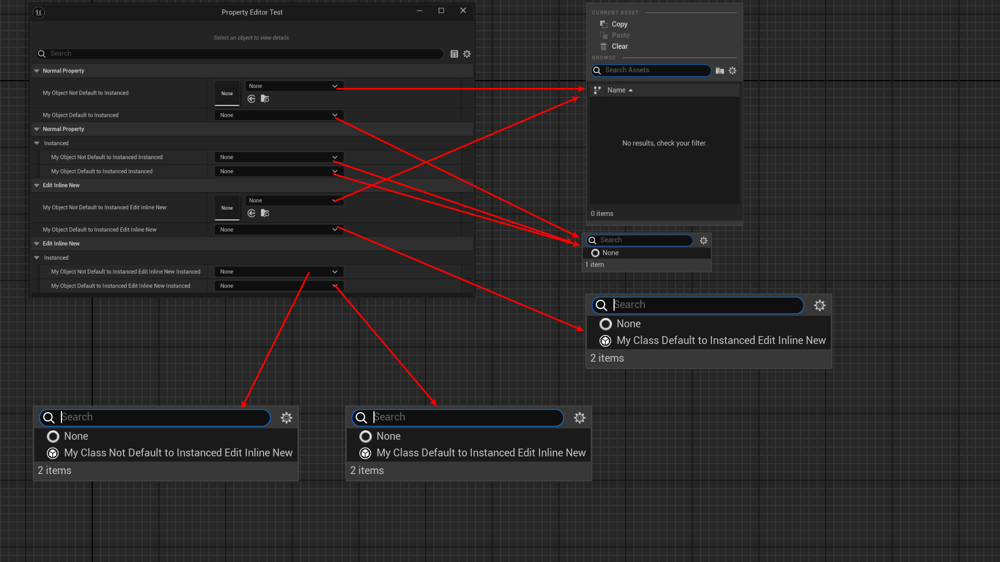

# DefaultToInstanced

- **功能描述：**  指定该类的所有实例属性都默认是UPROPERTY(instanced)，即都默认创建新的实例，而不是对对象的引用。
- **引擎模块：** Instance
- **元数据类型：** bool
- **作用机制：** 在ClassFlags中添加[CLASS_DefaultToInstanced](../../../../Flags/EClassFlags/CLASS_DefaultToInstanced.md)
- **常用程度：★★★★**

指定该类的所有实例属性都默认是UPROPERTY(instanced)，即都默认创建新的实例，而不是对对象的引用。

UPROPERTY(instanced)的含义是造成Property的CPF_InstancedReference，即为该属性创建对象实例。

所谓实例指的是为该UObject指针创建一个对象，而不是默认的去找到引擎内已有的对象的来引用。

也常常和EditInlineNew配合使用，以便在细节面板中可以创建对象实例。

UActorComponent本身就是带有DefaultToInstanced的。

## 示例代码：

```cpp
UCLASS(Blueprintable)
class INSIDER_API UMyClass_NotDefaultToInstanced :public UObject
{
	GENERATED_BODY()
public:
	UPROPERTY(EditAnywhere, BlueprintReadWrite)
	int32 MyProperty;
};

//	ClassFlags:	CLASS_MatchedSerializers | CLASS_Native | CLASS_RequiredAPI | CLASS_DefaultToInstanced | CLASS_TokenStreamAssembled | CLASS_Intrinsic | CLASS_Constructed
UCLASS(Blueprintable, DefaultToInstanced)
class INSIDER_API UMyClass_DefaultToInstanced :public UObject
{
	GENERATED_BODY()
public:
	UPROPERTY(EditAnywhere, BlueprintReadWrite)
	int32 MyProperty;
};

//	ClassFlags:	CLASS_MatchedSerializers | CLASS_Native | CLASS_EditInlineNew | CLASS_RequiredAPI | CLASS_DefaultToInstanced | CLASS_TokenStreamAssembled | CLASS_Intrinsic | CLASS_Constructed
UCLASS(Blueprintable, DefaultToInstanced, EditInlineNew)
class INSIDER_API UMyClass_DefaultToInstanced_EditInlineNew :public UObject
{
	GENERATED_BODY()
public:
	UPROPERTY(EditAnywhere, BlueprintReadWrite)
	int32 MyProperty;
};

UCLASS(Blueprintable, EditInlineNew)
class INSIDER_API UMyClass_NotDefaultToInstanced_EditInlineNew :public UObject
{
	GENERATED_BODY()
public:
	UPROPERTY(EditAnywhere, BlueprintReadWrite)
	int32 MyProperty;
};

UCLASS(Blueprintable, BlueprintType)
class INSIDER_API UMyClass_DefaultToInstanced_Test :public UObject
{
	GENERATED_BODY()

public:
	UPROPERTY(EditAnywhere, BlueprintReadWrite, Category = "NormalProperty")
	UMyClass_NotDefaultToInstanced* MyObject_NotDefaultToInstanced;

	UPROPERTY(EditAnywhere, BlueprintReadWrite, Category = "NormalProperty")
	UMyClass_DefaultToInstanced* MyObject_DefaultToInstanced;

	UPROPERTY(EditAnywhere, BlueprintReadWrite, Instanced, Category = "NormalProperty | Instanced")
	UMyClass_NotDefaultToInstanced* MyObject_NotDefaultToInstanced_Instanced;

	UPROPERTY(EditAnywhere, BlueprintReadWrite, Instanced, Category = "NormalProperty | Instanced")
	UMyClass_DefaultToInstanced* MyObject_DefaultToInstanced_Instanced;

public:
	UPROPERTY(EditAnywhere, BlueprintReadWrite, Category = "EditInlineNew")
	UMyClass_NotDefaultToInstanced_EditInlineNew* MyObject_NotDefaultToInstanced_EditInlineNew;

	UPROPERTY(EditAnywhere, BlueprintReadWrite, Category = "EditInlineNew")
	UMyClass_DefaultToInstanced_EditInlineNew* MyObject_DefaultToInstanced_EditInlineNew;

	UPROPERTY(EditAnywhere, BlueprintReadWrite, Instanced, Category = "EditInlineNew | Instanced")
	UMyClass_NotDefaultToInstanced_EditInlineNew* MyObject_NotDefaultToInstanced_EditInlineNew_Instanced;

	UPROPERTY(EditAnywhere, BlueprintReadWrite, Instanced, Category = "EditInlineNew | Instanced")
	UMyClass_DefaultToInstanced_EditInlineNew* MyObject_DefaultToInstanced_EditInlineNew_Instanced;
};

```

## 示例效果：

- MyObject_NotDefaultToInstanced和MyObject_NotDefaultToInstanced_EditInlineNew因为属性没有instanced的标记，因此打开是一个选择对象引用的列表。
- MyObject_DefaultToInstanced因为类上有DefaultToInstanced，因此该属性是Instanced。当然我们也可以手动给属性加上Instanced标记，正如MyObject_NotDefaultToInstanced_Instanced和MyObject_DefaultToInstanced_Instanced。出现了创建实例的窗口，但是还不能创建在细节面板里直接创建对象。
- MyObject_DefaultToInstanced_EditInlineNew，MyObject_NotDefaultToInstanced_EditInlineNew_Instanced，MyObject_DefaultToInstanced_EditInlineNew_Instanced这3个都可以直接在细节面板创建对象实例。是因为这个类本身要有EditInlineNew，另外这个属性要有Instanced（要嘛在该类上设置DefaultToInstanced以此该类的所有属性都自动是Instanced，或者在属性上单个设置Instanced）



## 原理：

```cpp
UObject* FObjectInstancingGraph::InstancePropertyValue(UObject* SubObjectTemplate, UObject* CurrentValue, UObject* Owner, EInstancePropertyValueFlags Flags)
{
	if (CurrentValue->GetClass()->HasAnyClassFlags(CLASS_DefaultToInstanced))
{
	bCausesInstancing = true; // these are always instanced no matter what
}
}
```