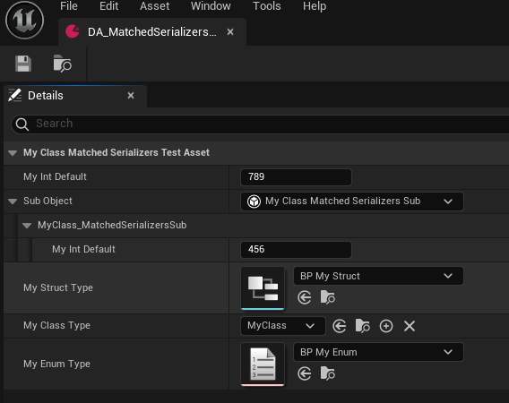

# MatchedSerializers

- **功能描述：** 指定类支持文本结构序列化
- **引擎模块：** Serialization
- **元数据类型：** bool
- **作用机制：** 在ClassFlags中增加[CLASS_MatchedSerializers](../../../../Flags/EClassFlags/CLASS_MatchedSerializers.md)，在Meta中添加[MatchedSerializers](../../../../Meta/Serialization/MatchedSerializers.md)
- **常用程度：** 0

该标识符只允许在NoExportTypes.h中使用，属于是引擎自用的内部标识符。

基本上大部分的类都拥有该标记，除了自身不导出的类，一般包括NoExportTypes.h定义的（除非手动加上MatchedSerializers，比如UObject），或者靠DECLARE_CLASS_INTRINSIC直接在源码里定义的元数据。

因此实际上大部分的类都拥有该标记。因为在UHT中只要不是NoExport的，就会自动的加上这个标记。

```cpp
// Force the MatchedSerializers on for anything being exported
if (!ClassExportFlags.HasAnyFlags(UhtClassExportFlags.NoExport))
{
			ClassFlags |= EClassFlags.MatchedSerializers;
}
```

## 结构化序列化器：

如果一个类支持文本格式，则StructuredArchive的结构的意思是会把类里的字段树形展开来序列化展示出来，从而方便人类理解。而如果不支持文本格式，则会把所有的字段值压进一个二进制buffer里（Data字段），这也是runtime时候用的方式。

测试代码：

```cpp

UCLASS(Blueprintable, BlueprintType,editinlinenew)
class INSIDER_API UMyClass_MatchedSerializersSub :public UObject
{
public:
	GENERATED_BODY()
public:
	UPROPERTY(EditAnywhere, BlueprintReadWrite)
	int32 MyInt_Default = 123;
};

UCLASS(Blueprintable, BlueprintType)
class INSIDER_API UMyClass_MatchedSerializersTestAsset:public UDataAsset
{
public:
	GENERATED_BODY()
public:
	UPROPERTY(EditAnywhere, BlueprintReadWrite)
	int32 MyInt_Default = 123;
	UPROPERTY(EditAnywhere, BlueprintReadWrite,Instanced)
	UMyClass_MatchedSerializersSub* SubObject;

	UPROPERTY(EditAnywhere, BlueprintReadWrite)
	UStruct* MyStructType;

	UPROPERTY(EditAnywhere, BlueprintReadWrite)
	UClass* MyClassType;

	UPROPERTY(EditAnywhere, BlueprintReadWrite)
	UEnum* MyEnumType;
};

void UMyClass_MatchedSerializers_Test::ApplyClassFlag()
{
	UMyClass_MatchedSerializersTestAsset::StaticClass()->ClassFlags |= CLASS_MatchedSerializers;
	UMyClass_MatchedSerializersSub::StaticClass()->ClassFlags |= CLASS_MatchedSerializers;
}

void UMyClass_MatchedSerializers_Test::RemoveClassFlag()
{
	UMyClass_MatchedSerializersTestAsset::StaticClass()->ClassFlags &= ~CLASS_MatchedSerializers;
	UMyClass_MatchedSerializersSub::StaticClass()->ClassFlags &= ~CLASS_MatchedSerializers;
}
```

在编辑器中创建测试数据Asset



然后在Editor选项里打开TextAssetFormatSupport(UEditorExperimentalSettings::bTextAssetFormatSupport)


然后在资产上就出现3个菜单支持把资产导出为文本。


ExportToTextFormat会在蓝图资产的同目录生成一个.utxt的文件，格式为json。通过动态的增删CLASS_MatchedSerializers这个标记来对比这个标记产生的差异：


可以发现，序列化出来的内容有明显的差异，不带有CLASS_MatchedSerializers标记的产生的右侧结果，把所有的字段值压进一个二进制buffer里（Data字段）。

## 内部机制原理：

CLASS_MatchedSerializers这个标记在UClass::IsSafeToSerializeToStructuredArchives中被使用，标明采用结构序列化器。是否支持文本导入导出，只在编辑器情况下使用。

在发生作用的只有SavePackage2.cpp和LinkerLoad.cpp，因此是只发生在保存UPackage的时候，作为子类对象。所以不能用简单的内存里Archive序列化来进行测试。

```cpp
bool UClass::IsSafeToSerializeToStructuredArchives(UClass* InClass)
{
	while (InClass)
	{
		if (!InClass->HasAnyClassFlags(CLASS_MatchedSerializers))
		{
			return false;
		}
		InClass = InClass->GetSuperClass();
	}
	return true;
}

//LinkerLoad.cpp
bool bClassSupportsTextFormat = UClass::IsSafeToSerializeToStructuredArchives(Object->GetClass());
if (IsTextFormat())//如果Ar序列化是文本格式
{
			FStructuredArchiveSlot ExportSlot = GetExportSlot(Export.ThisIndex);

			if (bClassSupportsTextFormat) //如果类本身支持文本格式
			{
				Object->GetClass()->SerializeDefaultObject(Object, ExportSlot);
			}
			else
			{
				FStructuredArchiveChildReader ChildReader(ExportSlot);
				FArchiveUObjectFromStructuredArchive Adapter(ChildReader.GetRoot());
				Object->GetClass()->SerializeDefaultObject(Object, Adapter.GetArchive());
			}
}

//SavePackage2.cpp
#if WITH_EDITOR
			bool bSupportsText = UClass::IsSafeToSerializeToStructuredArchives(Export.Object->GetClass());
#else
			bool bSupportsText = false;
#endif

if (bSupportsText)
{
				Export.Object->GetClass()->SerializeDefaultObject(Export.Object, ExportSlot);
}
else
{
				FArchiveUObjectFromStructuredArchive Adapter(ExportSlot);
				Export.Object->GetClass()->SerializeDefaultObject(Export.Object, Adapter.GetArchive());
				Adapter.Close();
}
```

文本格式只在编辑器环境下生效。

可以从源码看到，如果类本身支持文本格式序列化，则在Ar是文本格式的时候，直接可以序列化，采用默认的SerializeTaggedProperties。否则得采用FArchiveUObjectFromStructuredArchive 来适配一下，把对象指针转换为object path+ int32 Index的组合。

在引擎中打印出所有包含或不包含CLASS_MatchedSerializers的类，发现UStruct继承链下面的类开始包含（但是UClass却不包含），而上面UField的类则不包含，比如各种Property。类列表见Doc下txt文件。